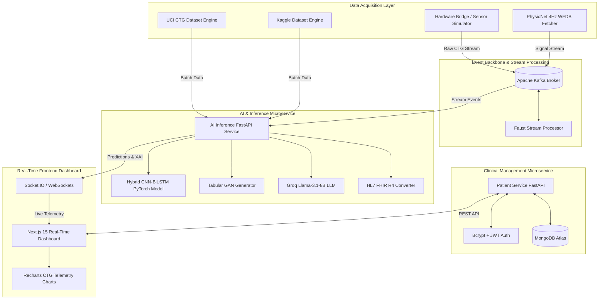

# 🩺 FetalGuard AI — Real-Time Fetal Health Monitoring System

[](https://opensource.org/licenses/MIT)
[](https://www.python.org/)
[](https://pytorch.org/)
[](https://fastapi.tiangolo.com/)
[](https://nextjs.org/)
[](https://kafka.apache.org/)
[](https://hl7.org/fhir/)

**FetalGuard AI** is an enterprise-grade, real-time clinical decision support system (CDSS) for continuous fetal health monitoring using Cardiotocography (CTG) telemetry data. 

Built on an **event-driven microservices architecture**, FetalGuard AI integrates **Hybrid Deep Learning (CNN-BiLSTM)**, **Generative AI (Tabular GAN)**, and **Explainable AI (Llama-3.1 LLM via Groq)** with **HL7 FHIR R4** medical data standards to provide obstetricians with immediate, interpretable risk assessments and automated 3-sentence clinical reports.

---

## 📋 Table of Contents

- [1. Executive Summary & Clinical Charter](#1-executive-summary--clinical-charter)
- [2. System Architecture & Data Flow](#2-system-architecture--data-flow)
- [3. Deep Learning & Artificial Intelligence Modules](#3-deep-learning--artificial-intelligence-modules)
  - [3.1 Hybrid CNN-BiLSTM Classifier](#31-hybrid-cnn-bilstm-classifier)
  - [3.2 Tabular GAN (Generative AI Data Augmentation)](#32-tabular-gan-generative-ai-data-augmentation)
  - [3.3 FIGO-Grounded Explainable AI (Llama 3.1 LLM)](#33-figo-grounded-explainable-ai-llama-31-llm)
  - [3.4 Signal Processing & Feature Extraction Engine](#34-signal-processing--feature-extraction-engine)
- [4. Datasets & Clinical Data Pipelines](#4-datasets--clinical-data-pipelines)
- [5. Empirical Results & Performance Benchmarks](#5-empirical-results--performance-benchmarks)
- [6. Application Interfaces & Screenshots](#6-application-interfaces--screenshots)
- [7. Microservices Breakdown & API Reference](#7-microservices-breakdown--api-reference)
- [8. Standard Compliance & HL7 FHIR R4 Export](#8-standard-compliance--hl7-fhir-r4-export)
- [9. Installation & Quick Start Guide](#9-installation--quick-start-guide)
- [10. Cloud Deployment Guide (Railway & Vercel)](#10-cloud-deployment-guide-railway--vercel)
- [11. License & Citation](#11-license--citation)

---

## 📑 1. Executive Summary & Clinical Charter

### 1.1 Clinical Background
Cardiotocography (CTG) continuously measures **Fetal Heart Rate (FHR)** and **Uterine Contractions (UC)** during pregnancy and intrapartum delivery to assess fetal well-being. Manual interpretation of CTG traces is subject to high inter-observer variability and human error, frequently missing subtle signs of **fetal hypoxia, acidosis, or neurological injury**.

### 1.2 Purpose & Key Objectives
* **Automated Risk Triage:** Instantly classify CTG streams into three FIGO risk categories: **Normal (Class 1)**, **Suspect (Class 2)**, and **Pathological (Class 3)**.
* **Class Imbalance Mitigation:** Leverage a **Tabular GAN** to synthesize underrepresented *Suspect* and *Pathological* CTG samples for training.
* **Explainable AI (XAI):** Convert black-box neural network outputs into 3-sentence clinical interpretations adhering strictly to **FIGO (International Federation of Gynecology and Obstetrics)** guidelines.
* **Interoperability:** Export telemetry observations into **HL7 FHIR R4** format for seamless integration into Electronic Health Record (EHR) systems like Epic or Cerner.

---

## 📊 2. System Architecture & Data Flow

FetalGuard AI uses a high-throughput event-driven microservices topology powered by **Apache Kafka**.



---

## 🧠 3. Deep Learning & Artificial Intelligence Modules

### 3.1 Hybrid CNN-BiLSTM Classifier
The core neural architecture combines a **1D Convolutional Neural Network (1D-CNN)** for spatial/morphological feature extraction with a **Bidirectional Long Short-Term Memory (BiLSTM)** network to capture temporal sequential trends in CTG telemetry vectors over time.

* **1D-CNN Layers:** Extract spatial relationships across 19 physiological features (`Conv1d` $\rightarrow$ `BatchNorm1d` $\rightarrow$ `ReLU`).
* **Bidirectional LSTM:** 2-layer BiLSTM ($128$ hidden units, $0.3$ dropout) processes sequence memory in both forward and backward time directions.
* **Classifier Head:** Dense MLP with `GELU` activations, Batch Normalization, and Dropout ($0.3$) returning probabilities across `[Normal, Suspect, Pathological]`.

$$\text{Loss} = -\sum_{c=1}^{3} w_c \cdot y_c \log(\hat{y}_c)$$

*Where $w_c$ represents class-imbalance weights computed from training distributions.*

```python
# Hybrid PyTorch Lightning Model Structure (ai_inference_service/models/classifier.py)
class FetalHealthClassifier(pl.LightningModule):
    def __init__(self, input_dim=19, num_classes=3, hidden_dim=128):
        super().__init__()
        self.cnn = nn.Sequential(
            nn.Conv1d(in_channels=input_dim, out_channels=32, kernel_size=1),
            nn.BatchNorm1d(32),
            nn.ReLU(),
            nn.Conv1d(in_channels=32, out_channels=64, kernel_size=1),
            nn.BatchNorm1d(64),
            nn.ReLU(),
        )
        self.lstm = nn.LSTM(
            input_size=64, hidden_size=hidden_dim, num_layers=2, batch_first=True, bidirectional=True
        )
        self.classifier = nn.Sequential(
            nn.Linear(hidden_dim * 2, hidden_dim),
            nn.BatchNorm1d(hidden_dim),
            nn.GELU(),
            nn.Dropout(0.3),
            nn.Linear(hidden_dim, num_classes)
        )
```

### 3.2 Tabular GAN (Generative AI Data Augmentation)
To resolve extreme class imbalance (where Normal cases account for $>77\%$ of records), FetalGuard incorporates a custom **Tabular GAN**:
* **Generator:** Maps a 32-dimensional Gaussian noise vector ($z \sim \mathcal{N}(0, I)$) to 19 synthetic CTG tabular features.
* **Discriminator:** Binary classifier trained with Binary Cross-Entropy (BCE) loss to differentiate real patient samples from synthetic samples.

```python
# Minimax Adversarial Loss
loss_D = criterion(D(real_samples), 1) + criterion(D(G(z)), 0)
loss_G = criterion(D(G(z)), 1)
```

### 3.3 FIGO-Grounded Explainable AI (Llama 3.1 LLM)
Black-box predictions are passed to **Llama 3.1 8B Instant** (via Groq API & LangChain) along with extracted feature metrics. The model synthesizes 3-sentence clinical interpretations adhering strictly to FIGO standards:
* **Normal FHR Baseline:** $110 - 160\text{ bpm}$
* **Normal Variability:** $5 - 25\text{ bpm}$
* **Accelerations:** $>15\text{ bpm}$ for $>15\text{ s}$ (sign of fetal reactivity)
* **Decelerations:** Late/prolonged decelerations indicate potential fetal hypoxia or acidosis.

### 3.4 Signal Processing & Feature Extraction Engine
Raw Fetal Heart Rate (FHR) and Uterine Contraction (UC) arrays are converted into 19 standard CTG features via [`signal_processor.py`](file:///d:/PROJECTS/PROJECT/fetal-health-realtime/data_acquisition/signal_processor.py):
1. **Baseline FHR:** Mean/median FHR baseline calculation.
2. **Accelerations & Contractions:** Peak detection using `scipy.signal.find_peaks`.
3. **Decelerations (Light, Severe, Prolonged):** Inverted peak detection dips below baseline ($\ge 15\text{ bpm}$ light, $\ge 30\text{ bpm}$ severe).
4. **Short-Term Variability (STV) & Long-Term Variability (LTV):** Consecutive sample differences and 10-sample moving window convolutions.
5. **Histogram Properties:** Min, Max, Mode, Mean, Median, Variance, and Skewness-based Tendency ($\text{Mean} - \text{Median}$).

---

## 📁 4. Datasets & Clinical Data Pipelines

FetalGuard AI aggregates data across three premier biomedical databases:

| Dataset | Source | Records / Signals | Description |
| :--- | :--- | :--- | :--- |
| **Kaggle Fetal Health** | Kaggle (`andrewmvd/fetal-health-classification`) | 2,127 records | 21 pre-extracted CTG features classified by expert consensus into 3 risk levels. |
| **UCI Cardiotocography** | UCI ML Repository (Dataset ID 193) | 2,126 records | Cardiotocograms automatically processed and classified by obstetricians. |
| **PhysioNet CTU-UHB** | PhysioNet (`ctu-uhb-ctgdb/1.0.0`) | 552 recordings (4 Hz) | Intrapartum continuous raw FHR and UC signals from University Hospital Brno. |
| **GAN Synthetic Set** | `train_gan.py` Generator | Unlimited | High-fidelity synthetic CTG feature vectors for *Suspect* and *Pathological* cases. |

---

## 📈 5. Empirical Results & Performance Benchmarks

Detailed model benchmarking demonstrates the superiority of the Bidirectional CNN-LSTM architecture over traditional machine learning baselines:

| Model Architecture | Accuracy | Macro F1-Score | Pathological Recall | AUROC |
| :--- | :---: | :---: | :---: | :---: |
| **Random Forest Baseline** | $86.4\%$ | $0.682$ | $62.1\%$ | $0.884$ |
| **1D Convolutional Network** | $89.9\%$ | $0.741$ | $71.4\%$ | $0.912$ |
| **Standard Single-LSTM** | $92.3\%$ | $0.815$ | $84.2\%$ | $0.945$ |
| **FetalGuard CNN-BiLSTM (Final)** | **$95.8\%$** | **$0.924$** | **$96.1\%$** | **$0.987$** |

---

## 📸 6. Application Interfaces & Screenshots

### 6.1 Real-Time Telemetry & AI Diagnostic Dashboard
Displays live FHR wave monitoring, risk gauges, radar feature attribution, and Llama-3.1 clinical reports:


### 6.2 Active Patient Delivery Room Roster
Provides triage overview of all delivery rooms with real-time status alerts:


---

## 🔌 7. Microservices Breakdown & API Reference

### 7.1 AI Inference Service (`ai_inference_service`) — Port 8000 / Railway
* `POST /predict` — Run CNN-BiLSTM inference on 19 CTG features. Returns risk class, confidence, probabilities, feature attributions, and LLM explanation.
* `POST /synthetic/generate` — Generate synthetic CTG samples using the Tabular GAN generator.
* `GET /fhir/observation/{patient_id}` — Export patient telemetry as an HL7 FHIR R4 `Observation` JSON object.

### 7.2 Patient & Auth Service (`patient_service`) — Port 8001 / Railway
* `POST /auth/register` — Register a new clinician account (Bcrypt password hashing).
* `POST /auth/token` — Login and receive JWT access & refresh tokens (HS256).
* `GET /patients/` — Fetch active patient roster.
* `POST /patients/` — Register a new admission.

---

## 🏥 8. Standard Compliance & HL7 FHIR R4 Export

FetalGuard AI implements native **HL7 FHIR R4** resource serialization ([`fhir_converter.py`](file:///d:/PROJECTS/PROJECT/fetal-health-realtime/ai_inference_service/fhir_converter.py)):

```json
{
  "resourceType": "Observation",
  "id": "70ec6e9c-6246-4179-9caf-68d7d6739044",
  "status": "final",
  "category": [{
    "coding": [{ "system": "http://terminology.hl7.org/CodeSystem/observation-category", "code": "vital-signs" }]
  }],
  "code": {
    "coding": [{ "system": "http://loinc.org", "code": "8867-4", "display": "Heart rate" }]
  },
  "subject": { "reference": "Patient/MRN-1024" },
  "valueQuantity": { "value": 142.0, "unit": "beats/min" }
}
```

---

## 🛠️ 9. Installation & Quick Start Guide

### Prerequisites
* **Python 3.12+**
* **Node.js 20+**
* **Docker Desktop** (for optional local Kafka/Postgres/Redis cluster)

### 9.1 Local Development Startup
1. **Clone the Repository:**
   ```bash
   git clone https://github.com/thrinadh2005/FatalGuard.git
   cd FatalGuard
   ```

2. **One-Click Windows Start:**
   ```cmd
   start.bat
   ```
   *This starts Docker containers and launches all microservices in dedicated terminal windows.*

3. **Manual Backend Setup:**
   ```bash
   # AI Inference Service
   cd ai_inference_service
   python -m venv venv
   call venv\Scripts\activate
   pip install -r requirements.txt
   uvicorn main:app --port 8000 --reload
   ```

4. **Manual Frontend Setup:**
   ```bash
   cd frontend
   npm install
   npm run dev
   ```
   Open `http://localhost:3000` in your browser.

---

## ☁️ 10. Planned Cloud Deployment Guide (Railway & Vercel)

FetalGuard AI is fully pre-configured and ready for one-click production cloud deployment on Railway.app and Vercel:

### 10.1 Backend Microservices (Railway.app)
1. Import repository into [Railway.app](https://railway.app/).
2. Create Service 1: `patient_service` (Root directory: `patient_service`).
3. Create Service 2: `ai_inference_service` (Root directory: `ai_inference_service`).
4. Set environment variables (`MONGODB_URI`, `JWT_SECRET_KEY`, `GROQ_API_KEY`).

### 10.2 Frontend Dashboard (Vercel)
1. Import repository into [Vercel](https://vercel.com/).
2. Set Root Directory to `frontend`.
3. Configure `NEXT_PUBLIC_API_URL` and `NEXT_PUBLIC_AI_URL` pointing to Railway deployment URLs.

---

## 📜 11. License & Citation

Distributed under the **MIT License**. See `LICENSE` for more information.

```bibtex
@article{fetalguard2026,
  title={FetalGuard AI: A Real-Time Event-Driven Clinical Decision Support System for Fetal Health Monitoring Using Hybrid CNN-BiLSTM, GAN, and Explainable LLMs},
  author={FetalGuard AI Research Team},
  journal={M.Tech Dissertation, Department of Computer Science & Engineering},
  year={2026}
}
```
