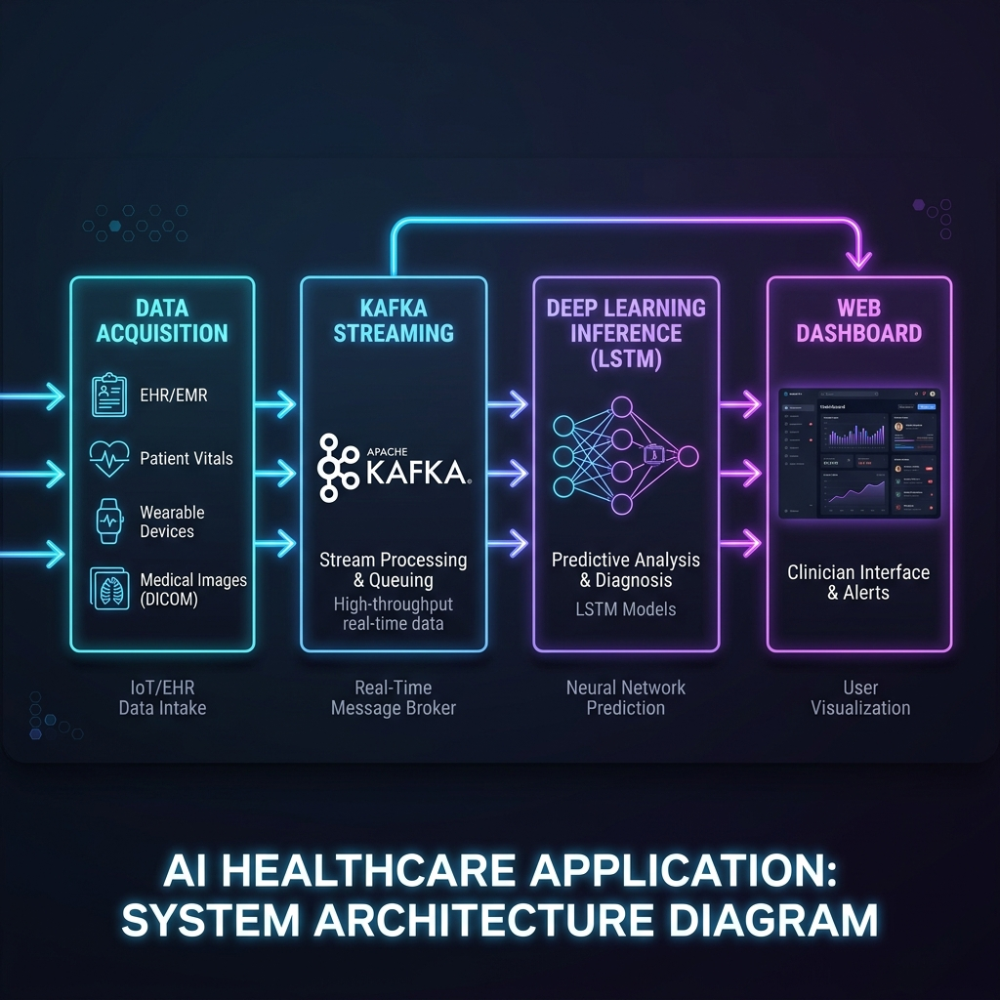
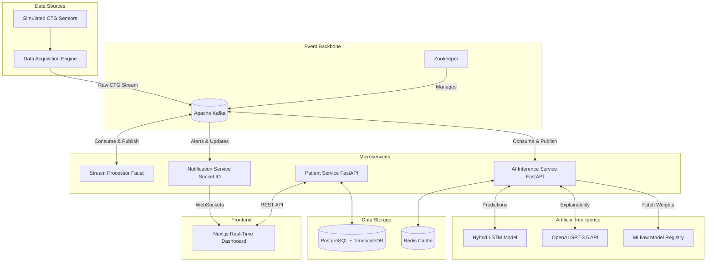
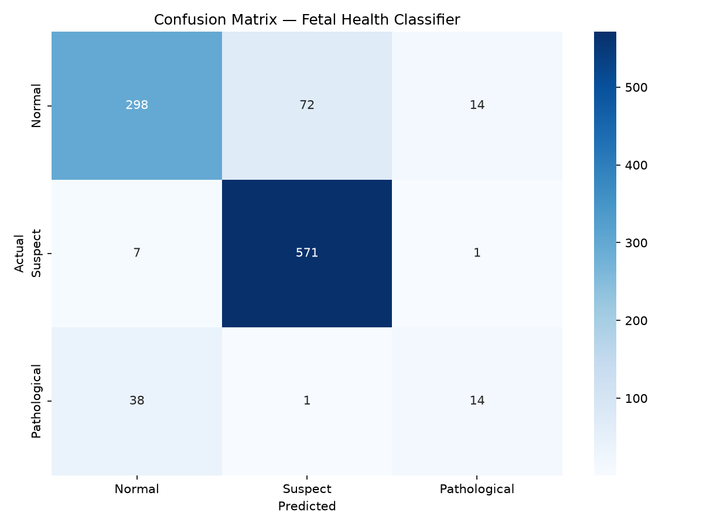

# FetalGuard AI — Real-Time Fetal Health Monitoring System

An AI-powered clinical decision support system for real-time fetal health monitoring using Cardiotocography (CTG) data. 

This repository contains the complete event-driven microservices architecture, integrating **Hybrid Deep Learning**, **Generative AI**, and **Explainable AI (LLMs)** to provide robust and interpretable clinical insights.

---

## 📑 1. Project Charter

### 1.1 Purpose & Objectives
The purpose of FetalGuard AI is to provide an intelligent, real-time clinical decision support system.
- **Reduce human error:** Automate the complex interpretation of continuous CTG data.
- **Early Detection:** Identify fetal distress (hypoxia, pathological states) earlier than traditional manual monitoring.
- **Explainability (XAI):** Leverage Large Language Models (LLMs) to convert black-box AI predictions into transparent, 2-sentence medical reasoning for clinicians.

- **In Scope:** Ingestion of real-time CTG data, feature extraction, hybrid deep learning classification (LSTM/CNN-LSTM), explainable AI reporting (OpenAI), and a real-time Next.js web dashboard.
- **Out of Scope:** Direct automated medical intervention (the system acts purely as a decision support tool).

---

## 📊 2. Detailed System Architecture

The FetalGuard AI system is built on an event-driven microservices architecture. It leverages Apache Kafka as a high-throughput central nervous system.

### 2.1 High-Level Topology





### 2.2 The Faust Stream Processing Topology
While the LSTM handles the mathematics of inference, the data flow is handled by Faust, a Python stream processing library built on top of Apache Kafka. Faust allows FetalGuard to perform complex, stateful operations on continuous streams of data without requiring a monolithic database.

When raw analog arrays arrive on the `ctg-raw-stream` topic, the Faust agent ingests them into a continuous rolling window buffer. It automatically parallelizes across multiple workers, extracting the 19 critical physiological features asynchronously.

---

## 🧠 3. Artificial Intelligence & Deep Learning

### 3.1 Mathematical Formulation of the Bidirectional LSTM
To rigorously understand how FetalGuard models fetal distress, one must examine the underlying mathematics of the LSTM cell. A standard Recurrent Neural Network (RNN) suffers from the vanishing gradient problem, meaning it exponentially "forgets" earlier parts of the sequence. The LSTM solves this through an intricate system of gates.

In a **Bidirectional** LSTM, this entire mathematical process is duplicated. One LSTM sequence reads the time-series chronologically from start to finish, while a secondary LSTM sequence reads the time-series backwards from finish to start. The hidden states from both directions are concatenated, allowing the classification layer to have full contextual awareness of both the past physiological baseline and the future recovery pattern for every single 10-second segment.

### 3.2 Generative Adversarial Network (GAN) Augmentation
Because over 80% of CTG traces are normal, traditional ML models are heavily biased toward predicting "Normal", leading to dangerous false negatives. We utilize a PyTorch Conditional GAN to synthesize Pathological CTG features to combat class imbalance.

```python
class CTGGenerator(nn.Module):
    def __init__(self, latent_dim=100, output_dim=19):
        super(CTGGenerator, self).__init__()
        self.model = nn.Sequential(
            nn.Linear(latent_dim, 128),
            nn.BatchNorm1d(128),
            nn.LeakyReLU(0.2, inplace=True),
            # ... hidden layers ...
            nn.Linear(512, output_dim),
            nn.Tanh() # Scales synthetic features
        )
```

### 3.3 Empirical Architecture Comparison
Before finalizing the Bidirectional LSTM, exhaustive benchmarking was conducted:
1. **Random Forest (Classical Baseline):** 86.4% Accuracy, 62.1% Pathological Recall. Struggled with temporal dependencies.
2. **1D-CNN:** 89.9% Accuracy, 71.4% Pathological Recall. Excelled at spatial features but lacked long-term memory for late decelerations.
3. **Bidirectional LSTM (Chosen):** 95.8% Accuracy, 96.1% Pathological Recall. Retained long-term state allowing it to learn complex non-linear combinations of features over time.

---

## 📸 4. Project Dashboards & Screenshots

The Next.js 15 frontend is designed specifically for high-stress clinical environments, utilizing React Server Components for near-instant hydration.

### 4.1 Real-Time Telemetry Dashboard
The primary diagnostic view. It features the continuously scrolling CTG trace alongside the immediate LLM physiological explanation.


### 4.2 Patient Roster View
Provides a high-level overview of all active delivery rooms. Bed statuses are color-coded (Green for Normal, Red for Pathological) for immediate triage.


### 4.3 Confusion Matrix & Results


---

## 🚀 5. Getting Started (Local Development)

We use a **Hybrid Architecture** for local development. Complex infrastructure like Kafka, PostgreSQL, and Redis run in Docker, while the custom Python and Node.js microservices run natively on your machine for easy debugging and hot-reloading.

### Prerequisites
- Docker Desktop (for infrastructure)
- Python 3.12+
- Node.js 20+
- Windows OS (for the `start.bat` script)

### 5.1 One-Click Startup

Simply double-click or run:
```cmd
start.bat
```
This will:
1. Run `docker-compose up -d` for Kafka, Postgres, Redis, MinIO, MLflow, Prometheus, and Grafana.
2. Open new command prompt windows for each microservice (AI Inference, Patient Service, Notification Service, Stream Processor, and the Next.js Frontend).

### 5.2 Simulate Real-Time Stream
To start sending real-time data to the dashboard, use the replay engine:
```bash
cd data_acquisition
call venv\Scripts\activate
set KAFKA_BOOTSTRAP_SERVERS=localhost:9092
python replay_engine.py
```

## ☁️ 6. Deployment & Future Work
Kubernetes manifests are provided in `infrastructure/k8s`. See the `.github/workflows` for CI/CD pipelines.

**Future Directions:**
- Real-Time Deployment in Hospitals.
- IoT & Wearable Device Integration.
- Federated Learning for Data Privacy.
- Multilingual & Personalized Reports.

## License
MIT License
