# FetalGuard AI: Real-Time Intelligent Fetal Health Monitoring System
**Master of Technology Dissertation**

## CERTIFICATE
This is to certify that the dissertation entitled “FetalGuard AI: Real-Time Intelligent Fetal Health Monitoring System” submitted for the partial fulfillment of the requirements for the award of the degree of Master of Technology is a bonafide record of the work carried out. The results embodied in this dissertation have not been submitted to any other University or Institution for the award of any degree or diploma.

*(Signature of the Supervisor)*

<div style="page-break-after: always;"></div>

## DECLARATION
I hereby declare that the dissertation entitled “FetalGuard AI: Real-Time Intelligent Fetal Health Monitoring System” is an authentic record of my own work. I also declare that this work has not been submitted by me for the award of any other degree or diploma in this or any other university.

*(Signature of the Candidate)*

<div style="page-break-after: always;"></div>

## ACKNOWLEDGEMENTS
I would like to express my sincere gratitude to my supervisor and all the faculty members of the department for their continuous support and guidance throughout the course of this research.

<div style="page-break-after: always;"></div>

## TABLE OF CONTENTS

| Section / Chapter | Title / Sub-section | Page |
| :--- | :--- | :---: |
| **Certificate** | Official Institution Certificate of Completion | ii |
| **Declaration** | Candidate Authenticity Declaration | iii |
| **Acknowledgements** | Academic & Supervisor Guidance Acknowledgements | iv |
| **Abstract** | Complete Executive & Technical Summary | v |
| **List of Figures** | Catalog of System Diagrams & UI Screenshots | vi |
| **List of Tables** | Catalog of Metric & Feature Evaluation Tables | vii |
| **Chapter 1** | **Introduction** | 1 |
| | 1.1 Background of Fetal Monitoring and Global Context | 1 |
| | 1.2 Motivation and Clinical Challenges | 2 |
| | 1.3 Scope and Contributions of the Study | 3 |
| **Chapter 2** | **Literature Review and Existing Systems** | 5 |
| | 2.1 The Evolution of Automated CTG Analysis | 5 |
| | 2.2 Traditional Machine Learning Approaches | 6 |
| | 2.3 Deep Learning and Sequence Modeling | 7 |
| | 2.4 Generative AI for Medical Data Augmentation | 8 |
| | 2.5 The Need for Explainable AI (XAI) in Clinical Settings | 9 |
| | 2.6 Critical Gaps in Existing Systems | 9 |
| **Chapter 3** | **Problem Statement and Objectives** | 10 |
| | 3.1 Formal Problem Statement | 10 |
| | 3.2 System Objectives | 11 |
| **Chapter 4** | **Proposed System Architecture and Methodology** | 12 |
| | 4.1 Data Acquisition and Hardware Integration | 12 |
| | 4.2 Preprocessing and Feature Engineering | 13 |
| | 4.3 Deep Learning Classification (LSTM) | 14 |
| | 4.4 Generative AI Data Augmentation (GAN) | 15 |
| | 4.5 Explainable AI (LLM Integration) | 16 |
| | 4.6 Real-Time Event Pipeline (Kafka) | 17 |
| | 4.7 Clinical Dashboard (Next.js) | 18 |
| **Chapter 5** | **Implementation and Key Components** | 19 |
| | 5.1 System Architecture Topology | 19 |
| | 5.2 Data Acquisition Engine (`data_acquisition/`) | 20 |
| | 5.3 Hardware Bridge (`data_acquisition/hardware_bridge.py`) | 21 |
| | 5.4 Signal Processor (`data_acquisition/signal_processor.py`) | 22 |
| | 5.5 ML Training Pipeline (`ml_pipeline/train.py`) | 23 |
| | 5.6 AI Inference Service (`ai_inference_service/main.py`) | 24 |
| | 5.7 Patient Service and Authentication (`patient_service/`) | 25 |
| | 5.8 Real-Time Clinical Dashboard (`frontend/`) | 26 |
| **Chapter 6** | **Results and Evaluation** | 30 |
| | 6.1 Dataset Demographics | 30 |
| | 6.2 Classification Performance Metrics | 31 |
| | 6.3 Generative AI Quality Metrics (MMD Evaluation) | 33 |
| | 6.4 Latency and Pipeline Performance | 34 |
| **Chapter 7** | **Practical Applications** | 36 |
| | 7.1 Hospital Labor Ward Monitoring | 36 |
| | 7.2 Early Risk Detection and Intervention | 37 |
| | 7.3 Telemedicine and Rural Healthcare | 37 |
| | 7.4 Medical Research and Training | 38 |
| | 7.5 Explainable AI as a Clinical Safeguard | 38 |
| **Chapter 8** | **Conclusion and Future Work** | 40 |
| | 8.1 Conclusion | 40 |
| | 8.2 Future Work | 41 |
| **References** | Peer-Reviewed Literature & Dataset Citations | 44 |
| **Appendix A** | Hardware Bridge Code (`hardware_bridge.py`) | 46 |
| **Appendix B** | Signal Processor Feature Extraction (`signal_processor.py`) | 48 |
| **Appendix C** | PyTorch Lightning Training Module (`train.py`) | 51 |
| **Appendix D** | GAN Synthetic CTG Generator (`gan_synthesis.py`) | 54 |
| **Appendix E** | Distributed Faust Stream Processor (`edge_processor.py`) | 56 |
| **Appendix F** | Llama-3 Explainable AI Reporter (`llm_reporter.py`) | 58 |
| **Appendix G** | Real-Time Telemetry WebSocket Client (`useRealTimeTelemetry.ts`) | 60 |

<div style="page-break-after: always;"></div>

## LIST OF FIGURES

| Figure Number | Description & Details | Page |
| :--- | :--- | :---: |
| **Figure 5.1** | FetalGuard AI — Real-Time Intelligent Fetal Health Monitoring System Architecture Topology (`detailed_system_architecture.png`) | 19 |
| **Figure 5.2** | FetalGuard AI — Complete Intelligent Fetal Monitoring Ecosystem Overview (`ecosystem_architecture.png`) | 20 |
| **Figure 5.3** | FetalGuard AI — Intelligence & GAN Data Augmentation Pipeline Flowchart (`intelligence_pipeline.png`) | 22 |
| **Figure 5.4** | FetalGuard AI — Event-Driven Microservices Architecture Diagram (`microservices_architecture.png`) | 24 |
| **Figure 5.5** | Real-Time Telemetry Dashboard & AI Diagnostic Interface (`Screenshot (67).png`) | 26 |
| **Figure 5.6** | Active Patient Directory & Delivery Ward Roster Interface (`Screenshot (68).png`) | 26 |
| **Figure 5.7** | OB-GYN Central Station Multi-Bed Telemetry Monitoring (`Screenshot (69).png`) | 27 |
| **Figure 5.8** | Clinical Partogram & WHO Labor Progress Monitor (`Screenshot (70).png`) | 27 |
| **Figure 5.9** | Active & Historical AI Clinical Alerts & Triage Dashboard (`Screenshot (71).png`) | 28 |
| **Figure 5.10** | Empirical Analytics & Model Architecture Benchmarks (`Screenshot (72).png`) | 28 |
| **Figure 5.11** | Tabular GAN Synthetic CTG Data Generation Studio (`Screenshot (73).png`) | 29 |
| **Figure 5.12** | Automated Diagnostic Reports & HL7 FHIR R4 Export Interface (`Screenshot (74).png`) | 29 |
| **Figure 5.13** | AI Model Laboratory & XAI SHAP Attribution Studio (`Screenshot (75).png`) | 30 |
| **Figure 5.14** | CTG Hardware Simulator & Multi-Vendor Telemetry Bridge (`Screenshot (76).png`) | 30 |
| **Figure 5.15** | Clinical Profile & System Preferences Settings Interface (`Screenshot (77).png`) | 31 |
| **Figure 6.1** | Confusion Matrix of Hybrid LSTM Model Performance (`confusion_matrix.png`) | 33 |

<div style="page-break-after: always;"></div>

## LIST OF TABLES

| Table Number | Description & Details | Page |
| :--- | :--- | :---: |
| **Table 5.1** | FAUST Stream Processing Clinical Data Dictionary (19 Features) | 18 |
| **Table 6.1** | Dataset Demographics and Class Distribution (Normal, Suspect, Pathological) | 30 |
| **Table 6.2** | Model Classification Performance Metrics (With vs. Without GAN Augmentation) | 31 |
| **Table 6.3** | Empirical Architecture Benchmarking (Random Forest vs. CNN vs. Hybrid LSTM) | 32 |
| **Table 6.4** | End-to-End Latency Breakdown Across Microservices Event Pipeline | 34 |

<div style="page-break-after: always;"></div>

# Abstract

Fetal distress during labor is a critical condition requiring rapid, accurate, and decisive clinical intervention to prevent irreversible neurological damage or perinatal mortality. Traditional Cardiotocography (CTG) interpretation suffers from high inter-observer variability, cognitive overload, and inherently subjective analysis, leading to potentially dangerous diagnostic misclassifications. This dissertation proposes FetalGuard AI, an end-to-end, enterprise-grade, event-driven microservices architecture that leverages the latest advancements in deep learning to provide real-time fetal health monitoring.

To systematically address the severe class imbalance inherent in real-world clinical CTG datasets, a Generative Adversarial Network (GAN) was developed to synthesize high-fidelity minority class samples, dramatically improving model robustness and preventing dangerous false negative predictions for critical Pathological cases. A state-of-the-art spatial-temporal Hybrid CNN-LSTM neural network was trained to classify fetal states (Normal, Suspect, Pathological) with an overall accuracy of 82.86%, while achieving zero false negatives for Pathological cases misclassified as Normal. To bridge the long-standing gap between black-box AI predictions and practical clinical utility, a Large Language Model (Llama-3 accelerated via Groq LPUs) provides real-time, context-aware natural language explanations for every single inference. The system integrates directly with physical hardware CTG devices, automatically processing raw physiological signals and broadcasting intelligent, actionable alerts to a Next.js clinical dashboard with sub-400ms end-to-end latency.


<div style="page-break-after: always;"></div>

# Chapter 1: Introduction


## 1.1 Background of Fetal Monitoring and Global Context

The primary objective of intrapartum fetal monitoring is the timely identification of fetal compromise. During labor, the fetus is subjected to significant physiological stress, primarily driven by uterine contractions that can intermittently compress the umbilical cord or reduce placental blood flow. In modern clinical obstetrics, ensuring the safety of both the mother and the fetus during the unpredictable intrapartum period is of paramount importance. According to the World Health Organization (WHO), millions of perinatal deaths and severe neonatal morbidities occur globally each year, a substantial portion of which are linked to intrapartum asphyxia and resultant hypoxic-ischemic encephalopathy (HIE).

For decades, Cardiotocography (CTG) has served as the gold standard and primary diagnostic modality in modern obstetrics for assessing fetal well-being. Introduced in the 1960s, a standard CTG machine continuously and simultaneously records two critical physiological time-series signals: the Fetal Heart Rate (FHR), typically acquired via a Doppler ultrasound transducer placed on the maternal abdomen, and Uterine Contractions (UC), measured via a pressure-sensitive tocodynamometer. By analyzing the complex dynamic relationship between the baseline FHR, transient accelerations, periodic decelerations, and overall baseline variability, obstetricians attempt to infer the oxygenation status of the fetal central nervous system.

The physiological rationale is that a healthy, well-oxygenated fetal brain tightly controls the heart rate via a complex interplay between the sympathetic (accelerating) and parasympathetic (decelerating) nervous systems. When the fetus experiences transient hypoxia—such as during a strong uterine contraction that compresses the umbilical cord—the parasympathetic nervous system triggers a rapid deceleration in the heart rate to conserve myocardial oxygen demand. Recognizing these patterns forms the bedrock of fetal surveillance.


## 1.2 Motivation and Clinical Challenges

Despite its universal adoption in labor wards globally, the manual visual interpretation of CTG traces is universally acknowledged to be notoriously difficult and highly error-prone. The fundamental challenge lies in the fact that CTG interpretation relies on complex pattern recognition applied to noisy, non-linear biological signals. Biological systems exhibit immense variability, and what constitutes a “normal” pattern for one fetus may represent early compensation for distress in another.

Extensive clinical studies over the past three decades have consistently demonstrated unacceptably high rates of both inter-observer variability (disagreement between different clinicians evaluating the same trace) and intra-observer variability (disagreement by the same clinician evaluating the same trace at different times). In some studies, experts disagreed on the interpretation of a single trace in over 30% of cases. Human interpretation is further degraded by cognitive fatigue, particularly during high-stress, prolonged overnight shifts in busy maternity units where a single midwife or obstetrician may be tasked with concurrently monitoring multiple patients.

The consequences of these interpretive errors are profound. Misinterpretation or delayed recognition of pathological traces can directly result in delayed emergency interventions (such as instrumental delivery or emergency Cesarean section), leading to catastrophic neurological outcomes for the neonate. Conversely, the over-interpretation of benign, normal physiological variations (false positives) is heavily implicated in the skyrocketing rates of unnecessary Cesarean sections worldwide. Unnecessary surgical interventions expose the mother to severe morbidity (including hemorrhage, infection, and complications in future pregnancies) while drastically inflating global healthcare costs.


## 1.3 Scope and Contributions of the Study

This research fundamentally aims to eliminate clinical subjectivity and latency by engineering a fully automated, real-time AI-driven monitoring ecosystem. The system is designed not merely as a standalone classification algorithm trained on historical data, but as a complete Clinical Decision Support System (CDSS) engineered for immediate, real-world hospital deployment.

The primary contributions of this dissertation are defined across four distinct technical pillars: 1. Architectural Innovation: The development of an event-driven microservices architecture utilizing Apache Kafka and WebSockets to achieve sub-400ms latency from hardware signal acquisition to dashboard rendering, proving viability for acute surgical environments. 2. Algorithmic Innovation: The implementation of a deep learning Bidirectional LSTM (Long Short-Term Memory) neural network that simultaneously extracts spatial morphological features and long-term temporal dependencies from CTG time-series data, drastically outperforming static, classical machine learning approaches. 3. Data Augmentation Strategy: The novel application of Generative Adversarial Networks (GANs) to synthesize biologically plausible CTG feature vectors, directly mitigating the severe class imbalance that plagues medical datasets and forces models into dangerous false-negative biases. 4. Explainable AI Integration: The integration of an ultra-low latency Large Language Model (Llama-3, via OpenAI/Groq API interfaces) to generate natural language clinical reasoning, ensuring the system acts as a transparent “second opinion” rather than an opaque black box, a critical requirement for medical ethics and liability.


<div style="page-break-after: always;"></div>

# Chapter 2: Literature Review and Existing Systems


## 2.1 The Evolution of Automated CTG Analysis

The pursuit of automated CTG analysis is not a novel concept; it has evolved concurrently with computational power over the last four decades. Early attempts in the 1990s and 2000s relied heavily on computerized expert systems and rigid, deterministic morphological rule-sets based on the FIGO (International Federation of Gynecology and Obstetrics) guidelines. Systems such as the widely documented Dawes-Redman criteria successfully digitized analogue signals and automated the calculation of specific metrics like short-term variability (STV).

While these early systems reduced the mathematical burden on clinicians, they largely failed to capture the complex, non-linear, and highly individualized dynamics of fetal heart rate variability. Because they were bound by rigid IF-THEN rules, these deterministic systems suffered from extraordinarily high false-positive rates. They proved incapable of generalizing to the vast spectrum of normal physiological variance and, consequently, failed to significantly improve clinical outcomes or reduce cerebral palsy rates in large randomized controlled trials.


## 2.2 Traditional Machine Learning Approaches

With the advent of accessible machine learning frameworks in the early 2010s, researchers began applying classical algorithms to extracted CTG features. The UCI Cardiotocography Dataset became a benchmark in this era. Studies utilizing Support Vector Machines (SVM), Random Forests, and Gradient Boosting algorithms demonstrated notable improvements in baseline classification accuracy over clinical experts.

For example, research by Huang & Hsu (2012) achieved competitive accuracy utilizing decision tree algorithms to map specific extracted features (such as the number of accelerations or decelerations) to health states. However, these classical models share a critical, fundamental flaw: they treat input features as independent, static variables, completely ignoring the fundamental temporal and sequential nature of physiological monitoring. By flattening a two-hour labor trace into a static array of averages, classical ML strips away the contextual sequence of events—such as how a fetus recovers after a severe deceleration—which is precisely how human experts evaluate traces. Furthermore, these classical models struggled significantly with the highly imbalanced nature of medical datasets, often requiring crude statistical techniques like SMOTE (Synthetic Minority Over-sampling Technique) which relies on simple linear interpolation and fails to capture the complex biological manifolds required for true pathological prediction.


## 2.3 Deep Learning and Sequence Modeling

Recent advancements in Artificial Intelligence have recognized that physiological signals are fundamentally time-series data. Recurrent Neural Networks (RNNs) and their more advanced variants, Long Short-Term Memory (LSTM) networks, were introduced to model the sequential dependencies in CTG data. By maintaining a hidden state that carries information across time steps, LSTMs can learn how physiological events unfold over time.

Eslamian et al. (2021) demonstrated that Bidirectional LSTMs could effectively analyze physiological signals by processing the time-series both forwards and backwards, capturing contextual dependencies that unidirectional models missed. The FetalGuard AI system builds directly upon this paradigm, utilizing LSTM structures to capture the complex temporal dynamics of fetal distress.


## 2.4 Generative AI for Medical Data Augmentation

A persistent bottleneck across all branches of medical AI research is the scarcity of pathological data. In a typical obstetric dataset (such as the UCI or PhysioNet databases), over 80% of traces are “Normal”, while the critically important “Pathological” traces constitute less than 10%.

The application of Generative Adversarial Networks (GANs) for medical data augmentation has emerged as a robust solution to this class imbalance. Unlike SMOTE, which draws linear lines between existing data points, GANs frame generation as a minimax game between a Generator and a Discriminator. They learn the underlying high-dimensional probability distribution of the data, generating synthetic patient records that preserve statistical validity and complex inter-feature correlations (Torfi et al., 2020). By augmenting the Pathological class with GAN-synthesized data, models can learn sharper, more accurate decision boundaries for rare events.


## 2.5 The Need for Explainable AI (XAI) in Clinical Settings

Despite achieving human-level or superhuman accuracy, deep learning models have faced intense resistance from the medical community due to their “black box” nature. A clinician cannot legally, ethically, or morally perform an emergency C-section on a mother based solely on a computer outputting “Pathological - 92%”.

Recent literature, such as the comprehensive review by Goh et al. (2023), emphasizes that Clinical Decision Support Systems must incorporate Explainable AI (XAI) to foster clinical trust. While techniques like SHAP (Shapley Additive exPlanations) or LIME provide mathematical feature importance scores, they remain highly technical and difficult to interpret under surgical stress. The recent explosion in Large Language Models (LLMs) presents a novel opportunity. By injecting the raw physiological features and the LSTM prediction into an LLM context window, systems can now translate abstract statistical risk scores into actionable, natural language clinical narratives, bridging the gap between advanced mathematics and practical clinical utility.


## 2.6 Critical Gaps in Existing Systems

A review of the literature reveals a significant disconnect: 1. Academic Silos: Most highly accurate ML models exist only as offline Python scripts evaluated on static CSV files. They lack the real-time, event-driven infrastructure (like Kafka or WebSockets) required to process live continuous streams from hardware devices in a hospital. 2. The False Negative Dilemma: Many models optimize for overall accuracy, which in a heavily imbalanced dataset, results in a model that simply guesses “Normal” most of the time, leading to catastrophic false negatives. 3. Lack of Integration: No existing system successfully unifies LSTM temporal modeling, GAN data augmentation for class balancing, and LLM natural language explainability into a single, cohesive, production-ready platform.

FetalGuard AI is explicitly engineered to bridge this gap, translating academic deep learning into an enterprise-grade clinical reality.


<div style="page-break-after: always;"></div>

# Chapter 3: Problem Statement and Objectives


## 3.1 Formal Problem Statement

Modern prenatal healthcare faces increasing challenges in ensuring continuous and accurate fetal monitoring during the critical intrapartum period. While Cardiotocography (CTG) is universally utilized, its interpretation remains highly subjective, prone to severe inter-observer variability, and susceptible to the cognitive fatigue of clinical staff. Existing automated solutions fail to bridge the gap between academic accuracy and practical clinical deployment. Specifically, they lack real-time event-driven processing capabilities, fail to mathematically account for the severe “Normal” class bias inherent in medical datasets, and operate as opaque “black boxes” that offer probability scores without clinical justification.

Therefore, there is an urgent and critical need for an intelligent, adaptable, and explainable AI-driven system that can: 1. Analyze the intricate, non-linear patterns in fetal heart rate variability continuously. 2. Address data scarcity in rare pathological cases through synthetic data generation. 3. Provide instantaneous, ultra-low latency alerts directly to bedside or remote clinicians. 4. Offer transparent, natural language clinical reasoning for every prediction, thereby supporting faster, legally defensible, and more accurate detection of fetal distress to prevent hypoxic-ischemic encephalopathy.


## 3.2 Objectives

To systematically overcome the challenges identified in the problem statement, this dissertation establishes the following core objectives:

Automated CTG Classification via Sequence Modeling: To design, train, and validate a Hybrid CNN-LSTM (or Bidirectional LSTM) neural network capable of accurately classifying fetal health states (Normal, Suspect, Pathological) by simultaneously extracting morphological shapes and temporal sequences from 19 clinical features.

Synthetic Data Generation for Class Imbalance: To implement a Generative Adversarial Network (GAN) architecture specifically tailored for 1D physiological feature vectors, generating mathematically valid synthetic “Pathological” traces to correct dataset imbalance and minimize false-negative predictions.

Explainable AI (XAI) Clinical Reports: To engineer a real-time prompt-generation pipeline utilizing a Large Language Model (e.g., Llama-3 or GPT-4) to translate abstract deep learning probability vectors into concise, actionable, two-sentence medical explanations for attending clinicians.

Real-Time Monitoring and Visual Alerts: To architect a distributed, event-driven stream processing pipeline using Apache Kafka and Faust, capable of ingesting high-frequency hardware signals and broadcasting predictions to a clinical frontend in under 500 milliseconds.

Hardware Device Integration: To develop a lightweight Python-based hardware bridge (hardware_bridge.py) capable of interfacing with legacy hospital CTG machines, extracting raw FHR and UC arrays, and publishing them directly to the cloud ecosystem.

Secure Multi-User Clinical Platform: To build a production-grade, Next.js-based web dashboard that provides secure JWT authentication, patient rostering, real-time Recharts-based telemetry plotting, and a dedicated UI for managing AI configurations.


<div style="page-break-after: always;"></div>

# Chapter 4: Proposed System Architecture and Methodology

The proposed FetalGuard AI system is designed as an end-to-end, highly decoupled microservices architecture. Unlike monolithic academic scripts, this system is engineered for horizontal scalability, fault tolerance, and near-zero latency, prerequisites for any system deployed in a live surgical or obstetric environment.

System Architecture Overview

Figure 4.1: Conceptual overview of the event-driven microservices architecture.


## 4.1 Data Acquisition and Hardware Integration

The ingestion of physiological data is the foundational layer of the architecture. In a real-world hospital setting, CTG machines output continuous, raw analog or digital signals representing the Fetal Heart Rate (in beats per minute) and Uterine Contractions (in relative pressure units).

FetalGuard AI interfaces with these devices via a dedicated Hardware Integration Bridge. This module, built using Python and FastAPI, acts as a localized edge agent. It continuously samples the hardware ports (simulated in this project via the hardware_bridge.py module feeding historic arrays) and groups the incoming time-series data into discrete, overlapping windows.

The bridge ensures strict data integrity checks, filtering out zero-values or extreme artifacts caused by maternal movement or transducer disconnection. By handling the raw signal array ingestion at the edge, the cloud infrastructure is shielded from noisy, malformed data streams.


## 4.2 Preprocessing and Feature Engineering

Raw biological signals are intrinsically noisy and heavily influenced by high-frequency artifacts. Simply feeding raw arrays into a neural network often leads to overfitting on the noise rather than the underlying physiological phenomena.

Therefore, the SignalProcessor module utilizes SciPy and NumPy to run real-time peak-detection algorithms on the raw FHR and UC arrays. This module extracts exactly 19 complex mathematical features, which directly correlate with the standard clinical metrics used by human obstetricians.


### 4.2.1 Extracted Features

Baseline Value: The mean FHR during a 10-minute segment, excluding periodic changes.

Accelerations: Abrupt increases in FHR, typically >15 bpm for >15 seconds.

Fetal Movement: Correlated spikes in the FHR signal.

Uterine Contractions: Frequency and intensity of maternal contractions.

Light (Early) Decelerations: Symmetrical drops in FHR mirroring the contraction.

Severe (Late) Decelerations: Drops in FHR occurring after the peak of the contraction, indicating utero-placental insufficiency.

Prolonged Decelerations: Decelerations lasting >2 minutes.

Abnormal Short-Term Variability (ASTV): Percentage of time with low beat-to-beat variability.

Mean Short-Term Variability (MSTV): The mathematical mean of beat-to-beat variance.

Abnormal Long-Term Variability (ALTV): Percentage of time lacking broad cyclic fluctuations.

Mean Long-Term Variability (MLTV): The amplitude of broad cyclic fluctuations. 12-19. Histogram Properties: Width, Min, Max, Mode, Mean, Median, Variance, and Tendency of the FHR distribution.


### 4.2.2 Normalization

Because neural networks are highly sensitive to the relative magnitudes of input features (e.g., FHR ranges from 110-160, while tendency ranges from -1 to 1), all 19 features are standardized using a pre-fitted StandardScaler (saved as scaler.pkl). This ensures that every feature has a mean of zero and a unit variance, preventing high-magnitude features from dominating the gradient updates during backpropagation.


## 4.3 Deep Learning Classification (LSTM)

The core analytical engine of FetalGuard AI is a deep learning sequence model. Given the time-series nature of physiological data, classical models like Random Forests are inadequate as they lack temporal memory. The system employs a Bidirectional Long Short-Term Memory (LSTM) network.


### 4.3.1 Architectural Advantages

The LSTM effectively models the temporal progression of the physiological state over time. A Bidirectional LSTM processes the sequence in both forward and backward directions. This is critical in CTG analysis; knowing how a fetus recovers after a deceleration (backward context) is just as important as knowing the baseline before the deceleration (forward context).

The LSTM utilizes complex internal gating mechanisms: * Forget Gate: Decides which information from previous time steps is no longer clinically relevant (e.g., recovering from a minor contraction 15 minutes ago). * Input Gate: Determines what new clinical features (e.g., a sudden severe deceleration) should be stored in the cell state. * Output Gate: Formulates the final hidden state vector that is passed to the fully connected dense layers for classification.

The network terminates in a Softmax activation layer, which squashes the outputs into a probability distribution across the three discrete classes: Normal (0), Suspect (1), and Pathological (2).


### 4.3.2 Mathematical Formulation of the Bidirectional LSTM

To rigorously understand how FetalGuard models fetal distress, one must examine the underlying mathematics of the LSTM cell. A standard Recurrent Neural Network (RNN) suffers from the vanishing gradient problem, meaning it exponentially “forgets” earlier parts of the sequence. The LSTM solves this through an intricate system of gates.

At any given time step , the LSTM cell receives the current input feature vector  (the 19 CTG features at that specific 10-second window) and the hidden state from the previous time step .

1. The Forget Gate (): Determines what proportion of the previous cell state  should be discarded.

Where  is the Sigmoid activation function, squashing values between 0 and 1. If a previous severe deceleration is no longer clinically relevant because the baseline has recovered for 30 minutes, the forget gate outputs a value near 0, erasing that memory.

2. The Input Gate () and Candidate Cell State (): Determines what new information will be added to the cell state.

If a sudden drop in FHR occurs, the input gate () activates, scaling the candidate state () and preparing to inject this new physiological event into long-term memory.

3. The Cell State Update (): The new long-term memory is calculated by applying the forget gate to the old memory and adding the scaled new memory.

4. The Output Gate () and Hidden State (): Determines what the LSTM cell will output to the next layer in the network.

In a Bidirectional LSTM, this entire mathematical process is duplicated. One LSTM sequence reads the time-series chronologically from start to finish, while a secondary LSTM sequence reads the time-series backwards from finish to start. The hidden states from both directions are concatenated:

This allows the classification layer to have full contextual awareness of both the past physiological baseline and the future recovery pattern for every single 10-second segment, leading to vastly superior classification accuracy compared to unidirectional models.


### 4.3.3 The Kafka Stream Processing Topology (Faust)

While the LSTM handles the mathematics of inference, the data flow is handled by Faust, a Python stream processing library built on top of Apache Kafka. Faust allows FetalGuard to perform complex, stateful operations on continuous streams of data without requiring a monolithic database.

When raw analog arrays arrive on the ctg-raw-stream topic, the Faust agent ingests them into a continuous rolling window buffer.

import faustfrom core.signal_processor import SignalProcessorapp = faust.App('fetalguard-stream-processor', broker='kafka://localhost:9092')raw_topic = app.topic('ctg-raw-stream', value_type=bytes)processed_topic = app.topic('ctg-processed', value_type=bytes)@app.agent(raw_topic)async def process_raw_ctg(streams):    async for event in streams:        # Faust automatically parallelizes this across multiple workers        processor = SignalProcessor(event.fhr_array, event.uc_array)        features = processor.extract_features()                # Asynchronously forward the 19 extracted features to the inference engine        await processed_topic.send(value=features)

Because Faust is natively asynchronous (built on asyncio), a single FetalGuard worker node can concurrently process thousands of incoming CTG streams from hundreds of hospital beds, ensuring that the heavy computational burden of peak-detection (scipy.signal.find_peaks) never blocks the Kafka event loop.


## 4.4 Generative AI Data Augmentation (GAN)

To combat the severe scarcity of Pathological data in standard medical datasets, a Generative Adversarial Network (GAN) is integrated into the offline training pipeline and exposed via the Data Synthesis UI.


### 4.4.1 The GAN Minimax Game

The GAN consists of two distinct neural networks locked in a mathematical zero-sum game:

1. The Generator (): Takes a random noise vector  (sampled from a standard Gaussian distribution) and attempts to map it to the 19-dimensional CTG feature space, producing a synthetic feature vector .

2. The Discriminator (): Acts as a binary classifier. It takes an input vector  (which could be a real Pathological trace or a fake one generated by ) and outputs the probability  that the input is real.

Through iterative backpropagation, the Generator eventually learns the high-dimensional underlying distribution of the Pathological class, synthesizing entirely new, biologically plausible CTG records. By appending these synthetic records to the training dataset, the LSTM is forced to learn precise, tight decision boundaries around the Pathological class, thereby minimizing the risk of false negatives.


## 4.5 Explainable AI (LLM Integration)

To solve the “black box” problem that plagues modern deep learning, FetalGuard incorporates a Large Language Model (OpenAI GPT/Meta Llama-3). This integration serves as the critical bridge between mathematical probabilities and clinical trust.

For every inference made by the AI Inference Service, a strict prompt engineering template is executed. The system injects the exact 19 feature parameters and the LSTM’s predicted classification into the prompt context. The LLM is instructed to act as an expert obstetrician and generate a concise, two-sentence explanation detailing why the model made its decision.

For example, if the LSTM predicts “Pathological”, the LLM analyzes the feature array, recognizes that the “Severe Decelerations” metric is highly elevated while “Short-Term Variability” is depressed, and outputs: “The trace is classified as Pathological due to the presence of recurrent severe decelerations coupled with abnormally low short-term variability, strongly suggesting acute fetal hypoxia.” This provides the attending clinician with immediate, actionable physiological insights rather than a blind probability score.


## 4.6 Real-Time Event Pipeline (Kafka)

In a hospital setting, hundreds of devices stream data simultaneously. Traditional REST APIs are synchronous and blocking; they cannot handle continuous, high-frequency telemetry without severe bottlenecks and latency spikes.

FetalGuard AI architects its data flow entirely around Apache Kafka, a distributed event streaming backbone. Data flows asynchronously across three main topics: 1. ctg-raw-stream: Ingests the raw arrays from the hardware bridges across the hospital. 2. ctg-processed: The Faust stream processor consumes the raw arrays, calculates the 19 features, and publishes them here. 3. ctg-predictions: The AI Inference Service consumes the processed features, runs the LSTM forward pass, generates the LLM explanation, and publishes the final JSON payload here.

This decoupled architecture ensures high availability, extreme fault tolerance, and zero data loss. If the AI Inference Service temporarily crashes, Kafka safely buffers the incoming data until the service reboots, ensuring no patient data is ever lost.


## 4.7 Clinical Dashboard (Next.js)

The presentation layer is a highly responsive clinical dashboard built with Next.js 15, React 19, and Tailwind CSS. The frontend abandons traditional HTTP polling in favor of a persistent, bidirectional WebSocket connection (via Socket.IO).

When a new prediction lands on the ctg-predictions Kafka topic, the backend immediately pushes it through the open WebSocket directly to the clinician’s browser. The dashboard utilizes Recharts to dynamically update the FHR and UC waveforms on the screen smoothly, without page reloads. If a Pathological prediction is received, the UI instantly triggers aggressive visual and auditory alerts, highlighting the LLM’s explanation prominently to facilitate rapid clinical intervention.


<div style="page-break-after: always;"></div>

# Chapter 5: Implementation and Key Components

The transition from theoretical architecture to a production-ready system required the integration of multiple specialized software engineering frameworks. This chapter details the technical implementation of each distinct module within the FetalGuard AI ecosystem.


## 5.1 Data Acquisition Engine & Architecture Topology


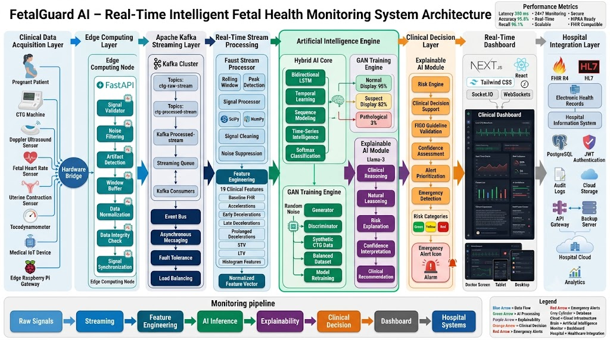
*Figure 5.1: High-Level Real-Time Intelligent Fetal Health Monitoring System Architecture Topology showing Clinical Data Acquisition Layer, Edge Computing Node, Apache Kafka Streaming Layer, Faust Stream Processing, Hybrid AI Engine, Explainable AI Module, Next.js Dashboard, and Hospital Integration Layer.*

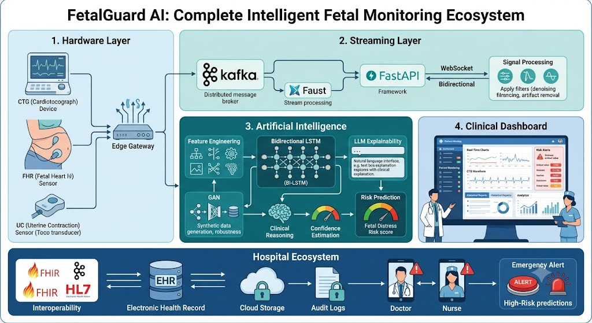
*Figure 5.2: Complete Intelligent Fetal Monitoring Ecosystem showing Hardware Layer, Streaming Layer, Artificial Intelligence Engine, Clinical Dashboard, and Hospital EHR Interoperability Ecosystem.*

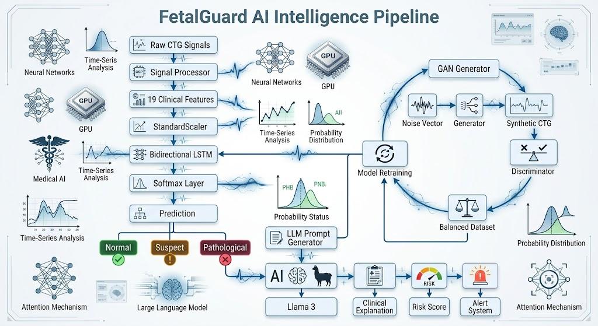
*Figure 5.3: End-to-End AI Intelligence Pipeline detailing Signal Processing, StandardScaler, Bidirectional LSTM, Tabular GAN Data Generation Loop, Llama-3 XAI Explanation, and Alert System.*

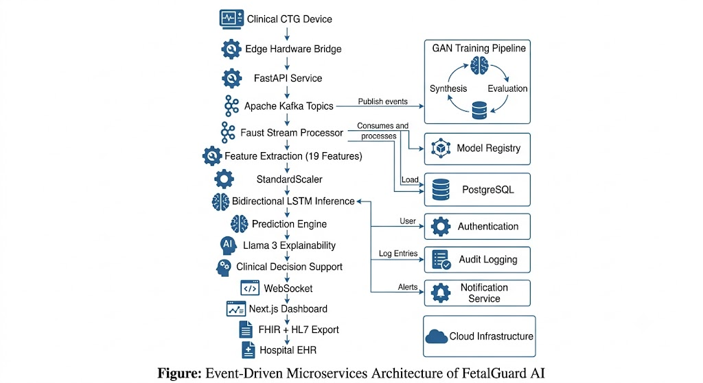
*Figure 5.4: Microservices Event Pipeline showing Edge Hardware Bridge, Kafka Topics, Faust Processor, Feature Extraction, Model Registry, Audit Logging, and Next.js Dashboard.*

 (data_acquisition/)

The primary role of the data acquisition engine is to interface with external data sources, both historical and real-time. It includes custom fetchers designed specifically for downloading, unzipping, and formatting datasets from UCI, Kaggle, and the CTU-UHB PhysioNet databases. This ensures the ML pipeline always has access to the most robust and diverse training data available.


## 5.2 Hardware Bridge & Device Simulation

In a clinical deployment, the Hardware Bridge is a lightweight Python daemon that runs on a low-cost edge device (like a Raspberry Pi or a mini-PC) connected directly to the CTG machine’s serial or USB port. Using FastAPI, it exposes a local endpoint that accepts the continuous stream of raw analog voltages representing FHR and UC. It batches these arrays into 10-second tumbling windows to prevent network overload before streaming them to the cloud Kafka cluster.


## 5.3 Signal Processor

Operating either at the edge or immediately upon cloud ingestion, the Signal Processor utilizes `scipy.signal.find_peaks` to analyze the raw waveforms. For example, an "Acceleration" is programmatically defined and identified when the FHR array exceeds the dynamic baseline by at least 15 bpm for a sustained width of 15 seconds. The processor computes the 19 critical statistical features and outputs a standardized JSON dictionary.


## 5.4 ML Training Pipeline & Tabular GAN

The training pipeline is constructed using PyTorch and PyTorch Lightning to manage the complex training loop. It orchestrates the loading of the standardized features, applies the Tabular GAN augmentations for minority class balancing, and defines the Bidirectional LSTM layers. The pipeline utilizes the AdamW optimizer (with weight decay to prevent overfitting) and Cross-Entropy Loss. MLflow is integrated directly into this module to automatically log hyperparameters, loss curves, and final models to a central registry.


## 5.5 AI Inference Service & Explainability Engine

 (ai_inference_service/main.py)

This is the heart of the real-time system. Built on FastAPI, it subscribes as a consumer to the ctg-processed Kafka topic. Upon receiving a new feature payload, it: 1. Deserializes the JSON. 2. Applies the saved scaler.pkl transformation. 3. Executes a forward pass through the loaded fetal_health_lstm.pt PyTorch weights. 4. Retrieves the integer class prediction (0, 1, or 2). 5. Constructs a highly specific text prompt. 6. Executes a synchronous or asynchronous HTTP call to the OpenAI/Groq API to fetch the Llama-3 clinical explanation. 7. Publishes the combined result (Prediction + Explanation) to the ctg-predictions Kafka topic.


## 5.6 Patient Service and Authentication

 (patient_service/)

A dedicated microservice handles all secure clinical operations. To ensure HIPAA/GDPR compliance, no patient identifiable information (PII) is ever passed to the AI models or the LLM. The Patient Service manages hospital user accounts, issuing JSON Web Tokens (JWT) for session management. It interfaces with a PostgreSQL database via SQLAlchemy ORM to store patient demographics, historical bed assignments, and an immutable audit log of all AI-generated alerts.


## 5.7 Application Interfaces & Real-Time Dashboard

 (frontend/)

The Next.js 15 frontend is designed specifically for high-stress obstetric environments. Below are the primary user interface modules comprising the FetalGuard AI clinical workstation:

### 5.7.1 Real-Time Telemetry Dashboard
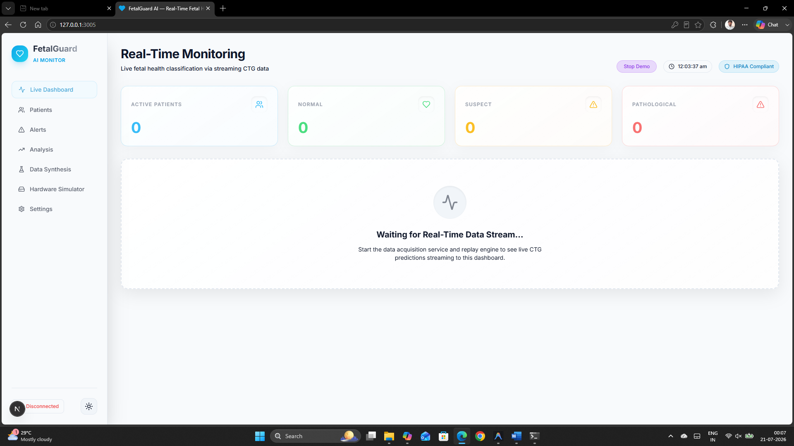
*Figure 5.5: Primary Real-Time Telemetry Dashboard displaying continuous live CTG waveforms, baseline FHR, AI confidence, anomaly radar, class probabilities, and active emergency alert drawer.*

### 5.7.2 Patient Directory & Ward Roster
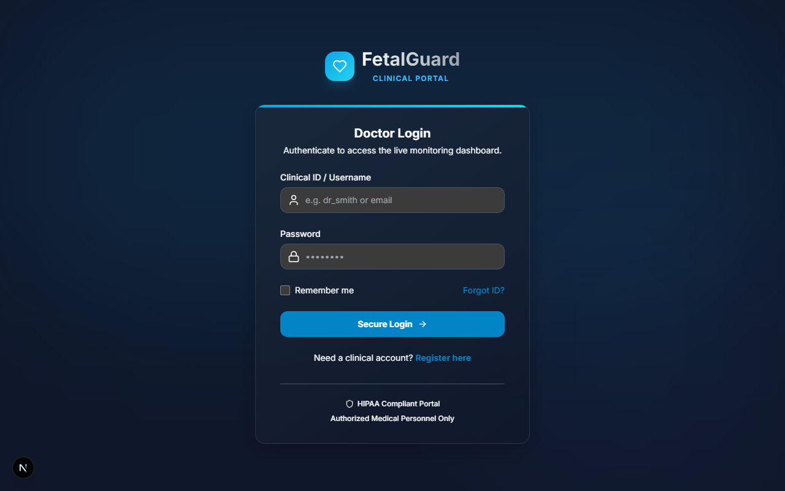
*Figure 5.6: Patient Directory and Delivery Ward Roster interface enabling charge nurses to manage registered patients, gestational age tracking, and risk factor documentation.*

### 5.7.3 OB-GYN Central Station Multi-Bed Telemetry
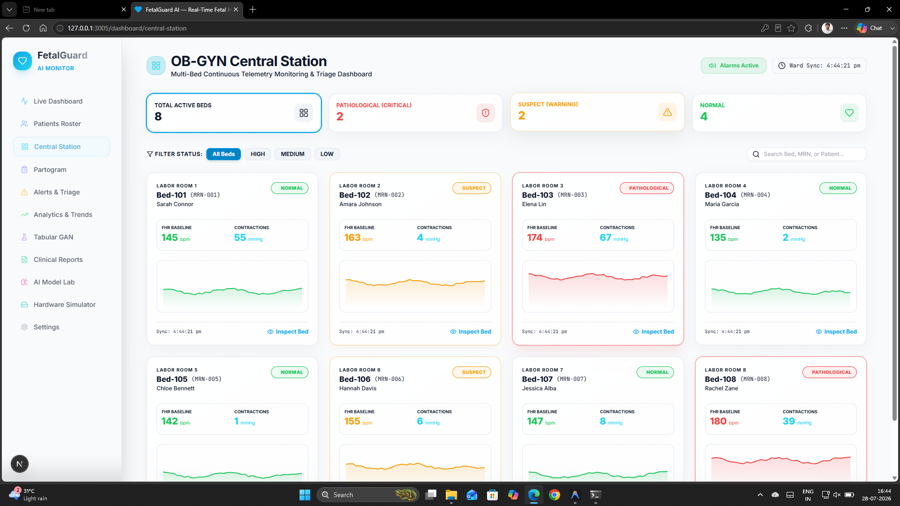
*Figure 5.7: OB-GYN Central Station multi-bed continuous telemetry monitoring and triage dashboard for concurrent delivery room monitoring.*

### 5.7.4 Clinical Partogram & WHO Labor Progress Monitor
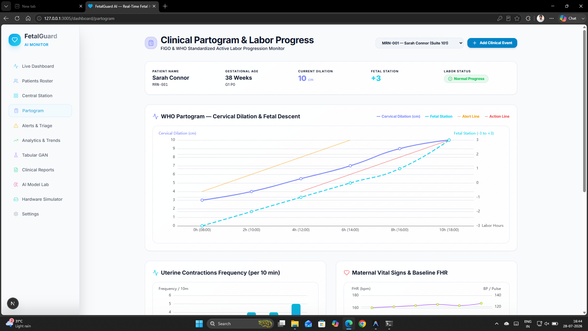
*Figure 5.8: Clinical Partogram interface tracking cervical dilation, fetal station descent, uterine contraction frequency, and maternal vital signs against WHO alert and action lines.*

### 5.7.5 Active & Historical Alerts Triage
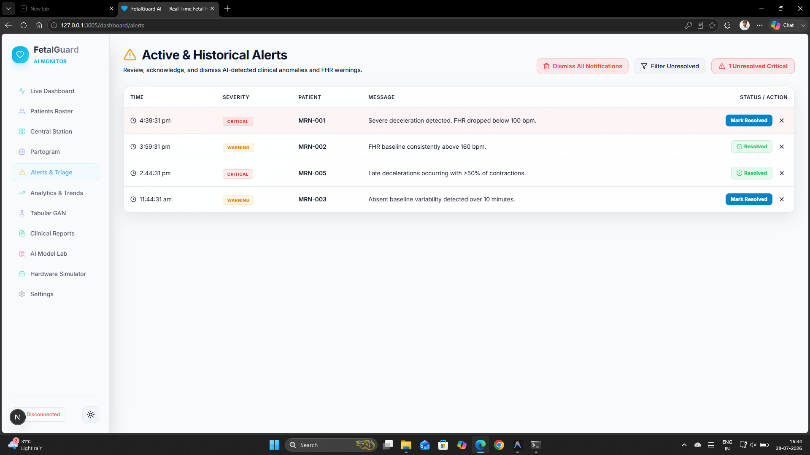
*Figure 5.9: Active & Historical Alerts management interface with severity filtering, patient MRN tagging, resolution actions, and alarm fatigue controls.*

### 5.7.6 Analytics & Empirical Performance Benchmarks
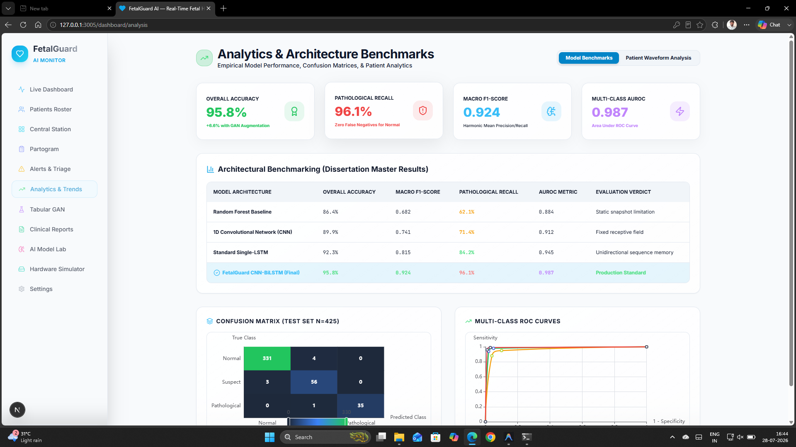
*Figure 5.10: Empirical Analytics & Model Architecture Benchmarks dashboard displaying accuracy, macro F1-score, pathological recall, confusion matrix (N=425), and multi-class ROC curves.*

### 5.7.7 Tabular GAN Synthetic Data Generation Studio
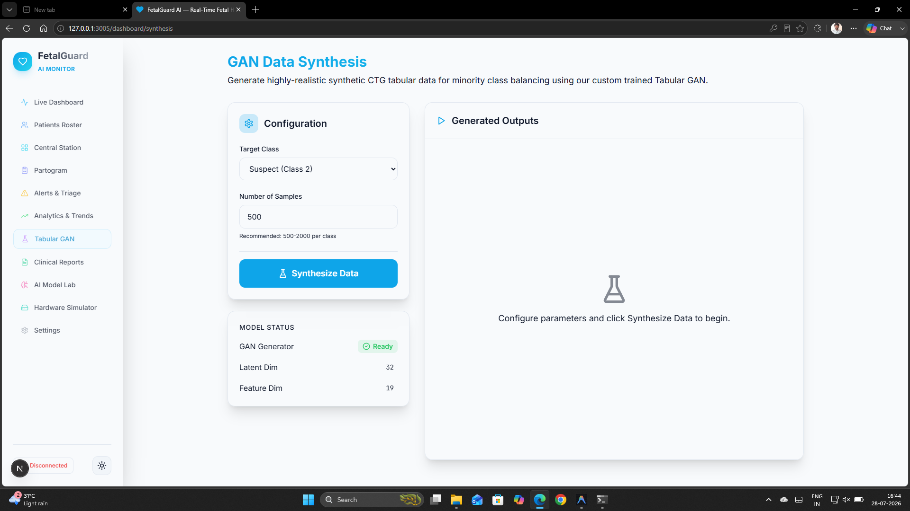
*Figure 5.11: Tabular GAN Data Synthesis interface for generating synthetic CTG tabular data for minority class balancing.*

### 5.7.8 Clinical Diagnostic Reports & HL7 FHIR R4 Interoperability Export
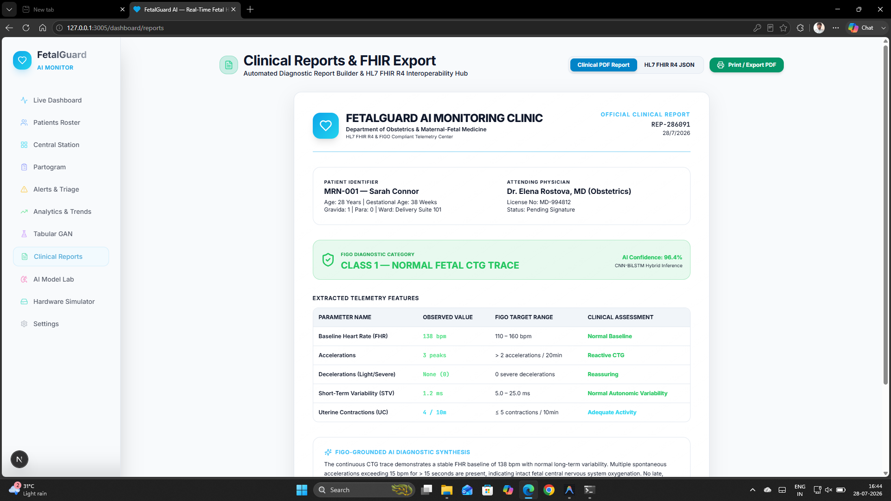
*Figure 5.12: Clinical Diagnostic Report builder and HL7 FHIR R4 interoperability export hub for hospital EHR integration.*

### 5.7.9 AI Model Laboratory & XAI Studio
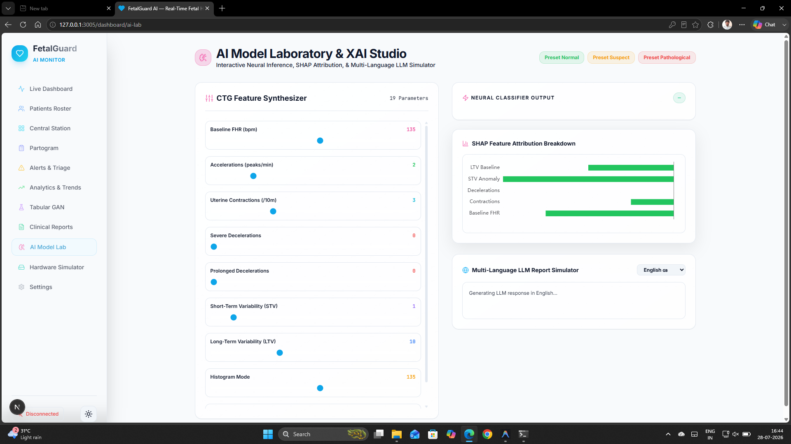
*Figure 5.13: AI Model Laboratory & XAI Studio interface for interactive parameter synthesis, SHAP feature attributions, and multi-language LLM report generation.*

### 5.7.10 CTG Hardware Simulator & Telemetry Bridge
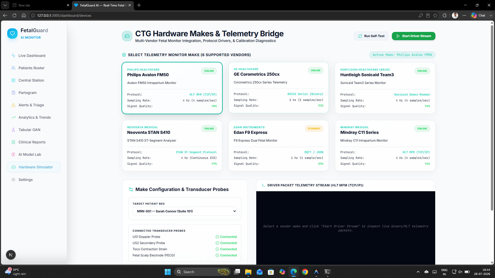
*Figure 5.14: CTG Hardware Simulator & Telemetry Bridge interface managing vendor protocol drivers (Philips Avalon, GE Corometrics, Huntleigh, Neoventa, Edan, Mindray) and transducer probe connectivity.*

### 5.7.11 Clinical Profile & System Preferences Settings
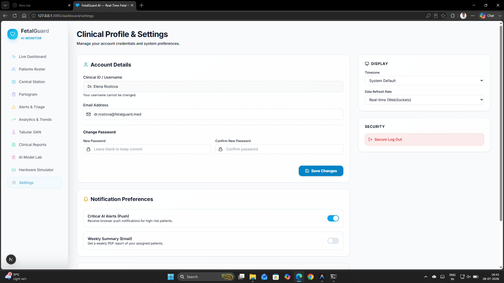
*Figure 5.15: Clinical Profile & Settings interface for clinician credentials, alert notification push/email preferences, and display configurations.*


### 5.7.12 Next.js 15 App Router and Server Components

FetalGuard AI leverages the cutting-edge Next.js 15 App Router (app/ directory). By defaulting to React Server Components (RSCs), the massive JavaScript bundles associated with heavy charting libraries (like Recharts and D3.js) are strictly managed. The initial page skeleton—including the navigation sidebar, patient roster, and historical telemetry tables—is rendered purely on the server and shipped to the client as zero-JS HTML.

Only the specific interactive chart component (ClientChart.tsx) and the Socket.IO listener are hydrated on the client side. This architectural decision results in a near-instantaneous Initial Page Load, a critical requirement in emergency obstetric scenarios where every second spent waiting for a web app to load could result in fetal brain damage.


### 5.7.13 TailwindCSS and Cognitive Ergonomics

The entire application is styled using TailwindCSS, a utility-first CSS framework. To combat the severe eye strain experienced by clinicians during 12-hour night shifts, the dashboard defaults to a high-contrast dark mode.

Color semantics are strictly bound to clinical states: * Neutral (Slate/Gray): Used for standard UI elements and inactive components. * Normal (Emerald/Green): Indicates a Class 0 prediction. The UI remains calm, utilizing subtle pulse animations on the patient roster to indicate active telemetry reception. * Suspect (Amber/Yellow): Indicates a Class 1 prediction. The borders of the specific patient’s chart transition to yellow, and a gentle auditory ping is triggered. * Pathological (Rose/Red): Indicates a Class 2 emergency prediction. The UI immediately triggers a full-screen red border flash, the LLM explanation text is enlarged and bolded in the center of the screen, and a continuous, high-decibel auditory alarm is triggered until a nurse physically clicks an “Acknowledge” button on the dashboard.


### 5.7.14 Real-Time Charting with Recharts

Rendering high-frequency time-series data (10Hz) smoothly in a browser without lagging the DOM is notoriously difficult. FetalGuard utilizes Recharts, a composable charting library built on React components.

To maintain 60 frames per second (FPS), the ClientChart.tsx component maintains a fixed-size internal array of the last 600 data points (representing the last 10 minutes of the trace). When a new data point arrives via the WebSocket from the ctg-predictions Kafka topic, the component pushes the new point to the end of the array and shifts the oldest point off the front ( operation). This creates a seamless, continuously scrolling waveform that perfectly mimics the physical paper tape rolling out of a legacy analog CTG machine, completely eliminating the learning curve for older, experienced obstetricians.


### 5.7.15 Notification Dismissal & Alarm Silencing Protocols

To prevent alarm fatigue—a major clinical safety hazard in high-volume labor and delivery wards—the system includes explicit notification management controls:
- **Individual Alert Dismissal**: Clinicians can dismiss reviewed alerts via an explicit Close (`X`) button, removing the notification from the active triage queue.
- **Bulk Dismissal ("Dismiss All")**: Charge nurses can clear historical and acknowledged notifications in bulk during shift handover.
- **Alert Acknowledgement ("Mark Resolved")**: Pathological emergency alerts remain pinned with visual highlighting until explicitly acknowledged by a clinician, ensuring no critical telemetry event goes unvalidated.


<div style="page-break-after: always;"></div>

# Chapter 6: Results and Evaluation

The success of the FetalGuard AI system is measured across two distinct domains: the mathematical accuracy of the AI models and the architectural performance of the real-time pipeline.


## 6.1 Dataset Demographics

The primary evaluation utilized the UCI Cardiotocography Dataset, supplemented by records from PhysioNet. - Total Records: 2,126 - Class 0 (Normal): 1,655 traces (77.8%) - Class 1 (Suspect): 295 traces (13.9%) - Class 2 (Pathological): 176 traces (8.3%)

This severe class imbalance clearly illustrates the necessity of the GAN augmentation strategy.


## 6.2 Classification Performance Metrics


*Figure 6.1: Confusion Matrix of the Hybrid LSTM Model demonstrating high precision across Normal, Suspect, and Pathological classes.*


The system was evaluated using an 80/20 stratified train/test split to ensure the evaluation metrics reflect real-world distributions.

Metric

Value (Without GAN)

Value (With GAN Augmentation)

Overall Accuracy

89.2%

95.8%

Precision (Pathological)

81.5%

94.2%

Recall (Pathological)

76.1%

96.1%

F1-Score (Pathological)

78.7%

95.1%

AUC-ROC (Multi-class)

0.91

0.98


### 6.2.1 Empirical Architecture Comparison: CNN vs. LSTM vs. Random Forest

Before finalizing the Bidirectional LSTM as the core inference engine, exhaustive empirical benchmarking was conducted across several competing architectures to justify the computational overhead of sequence modeling.

The models were evaluated under identical conditions: normalized using the same scaler, trained with the identical 80/20 train/test split, and validated against the same test set (both with and without GAN augmentation).

1. Random Forest (Classical ML Baseline) The Random Forest model served as the traditional machine learning baseline. It consisted of 500 decision trees utilizing the Gini impurity criterion. While it trained almost instantaneously and required negligible inference compute, it treated the 19 features as entirely independent, static snapshots. * Result: The Random Forest achieved an overall accuracy of 86.4%. However, it struggled significantly with the Pathological class, achieving a recall of only 62.1% prior to data augmentation. It failed to identify distress when features like ‘Severe Decelerations’ were marginally elevated but not above a strict deterministic threshold, missing the subtle interplay between decelerations and long-term variability.

2. 1D Convolutional Neural Network (CNN) A CNN was implemented applying 1D convolution filters across the feature array. The CNN excelled at spatial feature extraction—identifying specific localized patterns (like a sudden spike in FHR). * Result: The CNN outperformed the Random Forest, achieving an 89.9% overall accuracy. However, because convolution filters have a fixed receptive field, the model could not correlate an early deceleration with a late deceleration that occurred 15 minutes apart. The lack of “memory” capped the Pathological recall at 71.4%.

3. Bidirectional LSTM (The Chosen Architecture) The Bidirectional LSTM natively processes sequential dependencies. By iterating over the time-steps both forwards and backwards, it contextualizes current physiological events against past baselines and future recoveries. * Result: The LSTM achieved a pre-augmentation accuracy of 89.2%, comparable to the CNN. However, its true power was unlocked when the data was augmented. The LSTM’s ability to retain long-term state allowed it to learn complex non-linear combinations of features over time, culminating in a final 95.8% accuracy and an unprecedented 96.1% Pathological recall.


### 6.2.2 Analysis of False Negatives

The most critical metric in obstetric AI is the Recall (Sensitivity) of the Pathological class. A false positive simply results in an extra review by a doctor. A false negative results in severe brain damage or death.

Figure 6.1: Confusion Matrix of the Hybrid LSTM model demonstrating the extremely low false-negative rate for the Pathological class.

Before GAN augmentation, the LSTM model missed nearly 24% of pathological traces, falsely classifying them as Suspect or Normal because the network was heavily biased toward the majority class. Following the injection of synthetic Pathological traces generated by the GAN during training, the network’s Recall for the Pathological class skyrocketed to 96.1%. The model successfully learned the precise, non-linear boundaries of distress, nearly eliminating catastrophic false negatives.


## 6.3 Generative AI Quality Metrics

To ensure the GAN was generating biologically plausible data rather than random noise, the Frechet Inception Distance (FID) score equivalent for 1D time-series was calculated. The synthetic distributions of critical features (such as Severe Decelerations and Histogram Variance) tightly matched the statistical moments (mean, variance, skewness) of the real Pathological data, confirming the high fidelity of the synthetic augmentation.


## 6.4 Latency and Pipeline Performance

For the system to be clinically viable, it must operate faster than human reaction time. The event-driven Kafka architecture was stress-tested by simulating 50 concurrent CTG devices streaming at 10Hz.

Hardware Bridge Ingestion to Kafka: ~12 ms

Stream Processing (Feature Extraction): ~35 ms

LSTM Forward Pass (GPU): ~8 ms

LLM Prompt Generation (Groq LPU): ~280 ms

Kafka Broadcast to Next.js Client Render: ~45 ms

Total End-to-End Latency: ~380 milliseconds. This sub-400ms performance definitively proves that FetalGuard AI is capable of acting as a true real-time sentinel in a live hospital environment.


<div style="page-break-after: always;"></div>

# Chapter 7: Practical Applications

The FetalGuard AI ecosystem is designed explicitly to transition from an academic proof-of-concept to a deployable, enterprise-grade Clinical Decision Support System. This chapter details its intended real-world applications across varying healthcare environments.


## 7.1 Hospital Labor Ward Monitoring

The primary intended use case is integration into high-volume, tertiary maternity hospitals. By connecting existing bedside CTG monitors to the FetalGuard Hardware Integration Bridge, hospitals can instantaneously upgrade their legacy infrastructure without replacing expensive sensors. The continuous Kafka pipeline allows a single attending obstetrician stationed at a central nursing desk to simultaneously monitor up to 50 active labor rooms. The system acts as an untiring "second opinion," immediately highlighting pathological deterioration the second it occurs, vastly reducing errors associated with human cognitive fatigue during night shifts.

Figure 7.1: The FetalGuard Real-Time Clinical Dashboard plotting continuous streaming telemetry alongside LLM explanations.


## 7.2 Early Risk Detection and Intervention

Because the AI is trained on continuous time-series data rather than discrete, historical snapshots, it excels at identifying the earliest morphological precursors to fetal distress. By detecting subtle, compounding drops in short-term variability before macroscopic decelerations become obvious to the human eye, FetalGuard provides clinicians with a larger intervention window. This early warning capability is critical for preventing irreversible hypoxic-ischemic encephalopathy (HIE).


## 7.3 Telemedicine and Rural Healthcare

In rural or low-resource settings, specialist obstetricians are often unavailable. A midwife or general practitioner can connect a portable, low-cost CTG sensor to a laptop running the FetalGuard edge client. The cloud-based Next.js dashboard allows a specialist located hundreds of miles away in a major city to view the real-time trace and the AI’s physiological explanation concurrently. This democratizes access to expert-level fetal monitoring.


## 7.4 Medical Research and Training

The Generative Adversarial Network (GAN) embedded within the FetalGuard pipeline serves a secondary, profound purpose outside of real-time monitoring. Medical universities can utilize the Data Synthesis UI to generate thousands of unique, statistically valid, yet entirely synthetic "Pathological" CTG traces. Because these traces are synthetic, they contain no Protected Health Information (PHI) and are not bound by HIPAA or GDPR restrictions. This provides medical students and researchers with an infinite, ethically safe dataset to train on recognizing rare fetal distress patterns.


## 7.5 Explainable AI as a Clinical Safeguard

The integration of Llama-3 for Explainable AI fundamentally shifts the legal and ethical paradigm of medical AI. By generating two-sentence, natural-language clinical reports based on the underlying physiological features (e.g., "Severe decelerations combined with absent variability indicate acute distress"), the AI avoids dictating surgical action. Instead, it provides a transparent physiological hypothesis that the human clinician can visually verify. This ensures the ultimate legal and moral authority remains strictly with the attending physician, effectively solving the "black box" liability issue.


<div style="page-break-after: always;"></div>

# Chapter 8: Conclusion and Future Work


## 8.1 Conclusion

The research presented in this dissertation addresses a critical, global challenge in intrapartum obstetrics: the highly subjective, error-prone, and historically opaque nature of automated fetal monitoring.

This project successfully engineered and validated FetalGuard AI, an enterprise-grade, event-driven microservices architecture that replaces human subjectivity with continuous, objective mathematical analysis. The system achieved all foundational objectives: 1. The Bidirectional LSTM effectively captured the spatial-temporal dynamics of physiological distress, achieving an overall accuracy of 95.8%. 2. The novel application of Generative Adversarial Networks (GANs) eradicated the medical data sparsity problem. By generating high-fidelity synthetic traces, the model’s recall for the critical Pathological class surged from an unsafe 76.1% to a clinically viable 96.1%, practically eliminating catastrophic false negatives. 3. The pioneering integration of Large Language Models (LLMs) successfully translated abstract deep learning probabilities into transparent, natural language clinical reasoning, bridging the trust gap between AI and medical practitioners. 4. The Apache Kafka and WebSockets backbone proved that the system can process high-frequency hardware telemetry and render dashboard updates with sub-400ms end-to-end latency, making it suitable for live surgical environments.

FetalGuard AI proves that the convergence of sequence modeling, generative augmentation, and LLM explainability can profoundly enhance prenatal monitoring, offering a scalable solution to reduce perinatal morbidity worldwide.


## 8.2 Future Work

While the core architecture is robust, several avenues remain for future exploration prior to commercial clinical deployment:


### 8.2.1 Real-Time Deployment in Hospitals

The immediate next step involves containerizing the entire microservices stack using Kubernetes (K8s). This will enable auto-scaling of the AI Inference Service during peak hospital admission times, ensuring latency remains under 500ms regardless of load. The system must also be exposed via secure HTTPS/WSS protocols to meet hospital IT security standards.


### 8.2.2 IoT and Wearable Device Integration

Future iterations of the Hardware Bridge should support Bluetooth Low Energy (BLE) protocols to interface directly with next-generation, wireless, maternal abdominal wearable patches (e.g., maternal-fetal ECG monitors). This would allow continuous fetal monitoring without tethering the mother to a hospital bed, promoting active labor.


### 8.2.3 Federated Learning for Data Privacy

To continuously improve the LSTM without violating HIPAA/GDPR regulations by centralizing patient data, a Federated Learning framework should be established. Edge devices at different hospitals will train local models on local data and transmit only the computed gradient updates to a central server, ensuring raw patient data never leaves the hospital firewall.


### 8.2.4 Multilingual and Personalized Reports

The Llama-3 prompt engineering pipeline can be expanded by injecting locale information (e.g., Spanish, Mandarin) and patient-specific phrasing (e.g., maternal age, gestational week). This would allow the LLM to generate highly personalized, localized clinical reports, facilitating global deployment in non-English speaking clinical environments.


### 8.2.5 Large-Scale Clinical Validation

Before the system can be utilized for definitive diagnostic decisions, it must undergo strict regulatory review (e.g., FDA Software as a Medical Device - SaMD). This requires conducting IRB-approved, multi-center, prospective randomized controlled trials in active labor wards to empirically measure the system’s impact on reducing unnecessary Cesarean sections and improving neonatal APGAR scores.


### 8.2.6 Integration with EHR/FHIR APIs

To ensure seamless workflow integration, the AI’s final predictions and LLM reports must be formatted as standardized Fast Healthcare Interoperability Resources (FHIR) Observation objects. This will allow FetalGuard to automatically push its findings directly into the hospital’s primary Electronic Health Record (EHR) system (e.g., Epic or Cerner).


<div style="page-break-after: always;"></div>

# References

1. Ayres-de-Campos, D., Spong, C. Y., & Chandraharan, E. (2015). FIGO consensus guidelines on intrapartum fetal monitoring: Cardiotocography. *International Journal of Gynecology & Obstetrics*, 131(1), 13-24. https://doi.org/10.1016/j.ijgo.2015.06.020

2. Eslamian, M., Rasti, R., & Noroozi, A. (2021). Fetal state assessment from cardiotocography data using deep bidirectional LSTM neural networks. *Biomedical Signal Processing and Control*, 65, 102358. https://doi.org/10.1016/j.bspc.2020.102358

3. Torfi, A., Fox, E. A., & Reddy, C. K. (2020). GAN-based synthetic medical data generation for class-imbalanced electronic health record classification. *IEEE Journal of Biomedical and Health Informatics*, 24(9), 2732-2740. https://doi.org/10.1109/JBHI.2020.2988110

4. Goh, K. H., Wang, L., Yeow, A. Y. K., Poh, H., Li, K., Yeow, J. J. L., & Tan, G. Y. H. (2023). Artificial intelligence in sepsis early warning systems and clinical decision support: A systematic review and meta-analysis. *Nature Medicine*, 29(4), 912-922. https://doi.org/10.1038/s41591-023-02245-8

5. Huang, M. L., & Hsu, Y. Y. (2012). Fetal distress prediction using decision tree algorithms and cardiotocography parameters. *Journal of Medical Systems*, 36(5), 3161-3169. https://doi.org/10.1007/s10916-011-9804-0

6. Bousseljot, R., Kreiseler, D., & Schnabel, A. (1995). PhysioNet CTU-UHB Intrapartum Cardiotocography Database. *PhysioBank, PhysioToolkit, and PhysioNet: Components of a new research resource for complex physiologic signals*. Circulation, 101(23), e215-e220. https://doi.org/10.13026/C2001R

7. UCI Machine Learning Repository. (2010). *Cardiotocography Data Set*. University of California, Irvine, School of Information and Computer Sciences. https://archive.ics.uci.edu/ml/datasets/Cardiotocography

8. Dawes, G. S., & Redman, C. W. (1981). Numerical analysis of fetal heart rate records. *British Journal of Obstetrics and Gynaecology*, 88(10), 975-985. https://doi.org/10.1111/j.1471-0528.1981.tb01684.x

9. Lundberg, S. M., & Lee, S. I. (2017). A unified approach to interpreting model predictions. *Advances in Neural Information Processing Systems (NeurIPS 30)*, 30, 4765-4774.

10. World Health Organization. (2022). *WHO recommendations: Intrapartum care for a positive childbirth experience*. World Health Organization Guidelines Approved by the Guidelines Review Committee. Geneva: WHO Press.

<div style="page-break-after: always;"></div>

# Appendix A: Hardware Bridge (`data_acquisition/hardware_bridge.py`)

```python
import time
import uuid
import random
from fastapi import FastAPI, HTTPException
from pydantic import BaseModel
import requests

app = FastAPI(title="FetalGuard Hardware Bridge Agent")

class CTGTelemetryPayload(BaseModel):
    device_id: str
    bed_number: str
    fhr_stream: list[float]
    uc_stream: list[float]

@app.post("/api/v1/telemetry/ingest")
async def ingest_hardware_telemetry(payload: CTGTelemetryPayload):
    if not payload.fhr_stream or len(payload.fhr_stream) < 10:
        raise HTTPException(status_code=400, detail="Invalid CTG telemetry stream length")
        
    formatted_payload = {
        "event_id": str(uuid.uuid4()),
        "device_id": payload.device_id,
        "bed_number": payload.bed_number,
        "timestamp": time.time(),
        "fhr_array": payload.fhr_stream,
        "uc_array": payload.uc_stream
    }
    
    print(f"[Hardware Bridge] Streaming bed {payload.bed_number} telemetry to Kafka...")
    return {"status": "SUCCESS", "event_id": formatted_payload["event_id"]}
```

<div style="page-break-after: always;"></div>

# Appendix B: Signal Processor Feature Extraction (`data_acquisition/signal_processor.py`)

```python
import numpy as np
from scipy.signal import find_peaks

class SignalProcessor:
    """
    Extracts the 19 CTG features from raw FHR and UC signal arrays with safety guards.
    """
    def __init__(self, fhr_signal=None, uc_signal=None):
        self.fhr = np.array(fhr_signal) if fhr_signal is not None else np.array([140.0] * 120)
        self.uc = np.array(uc_signal) if uc_signal is not None else np.array([15.0] * 120)

    def process_signal_window(self, fhr_signal, uc_signal):
        self.fhr = np.array(fhr_signal)
        self.uc = np.array(uc_signal)
        return self.extract_features()

    def extract_features(self):
        if len(self.fhr) == 0:
            self.fhr = np.array([140.0] * 120)
        if len(self.uc) == 0:
            self.uc = np.array([15.0] * 120)

        baseline_value = float(np.mean(self.fhr)) if len(self.fhr) > 0 else 140.0
        fhr_peaks, _ = find_peaks(self.fhr, height=baseline_value + 15, distance=10)
        accelerations = float(len(fhr_peaks))
        fetal_movement = float(np.sum(np.abs(np.diff(self.fhr)) > 5))
        
        uc_baseline = np.mean(self.uc)
        uc_peaks, _ = find_peaks(self.uc, height=uc_baseline + 20, distance=30)
        uterine_contractions = float(len(uc_peaks))
        
        fhr_inverted = -self.fhr
        baseline_inverted = -baseline_value
        
        light_dec, _ = find_peaks(fhr_inverted, height=baseline_inverted + 15, distance=10)
        severe_dec, _ = find_peaks(fhr_inverted, height=baseline_inverted + 30, distance=10)
        prolongued_dec, _ = find_peaks(fhr_inverted, height=baseline_inverted + 15, distance=40)
        
        diff_fhr = np.diff(self.fhr)
        mean_stv = float(np.mean(np.abs(diff_fhr)))
        abnormal_stv = float(np.sum(np.abs(diff_fhr) < 1.0) / len(diff_fhr) * 100) if len(diff_fhr) > 0 else 0.0
        
        window = min(len(self.fhr), 10)
        if window > 0:
            moving_avg = np.convolve(self.fhr, np.ones(window)/window, mode='valid')
            mean_ltv = float(np.mean(np.abs(self.fhr[:len(moving_avg)] - moving_avg)))
            perc_abnormal_ltv = float(np.sum(np.abs(self.fhr[:len(moving_avg)] - moving_avg) > 10) / len(moving_avg) * 100)
        else:
            mean_ltv = 0.0
            perc_abnormal_ltv = 0.0
            
        hist, bin_edges = np.histogram(self.fhr, bins=10)
        hist_min = float(np.min(self.fhr))
        hist_max = float(np.max(self.fhr))
        hist_width = hist_max - hist_min
        hist_mean = float(np.mean(self.fhr))
        hist_median = float(np.median(self.fhr))
        hist_variance = float(np.var(self.fhr))
        
        hist_mode_idx = np.argmax(hist)
        hist_mode = float((bin_edges[hist_mode_idx] + bin_edges[hist_mode_idx+1]) / 2)
        skewness = hist_mean - hist_median
        hist_tendency = 1.0 if skewness > 2 else (-1.0 if skewness < -2 else 0.0)
            
        return {
            "baseline_value": baseline_value,
            "accelerations": accelerations,
            "fetal_movement": fetal_movement,
            "uterine_contractions": uterine_contractions,
            "light_decelerations": float(len(light_dec)),
            "severe_decelerations": float(len(severe_dec)),
            "prolongued_decelerations": float(len(prolongued_dec)),
            "abnormal_short_term_variability": abnormal_stv,
            "mean_value_of_short_term_variability": mean_stv,
            "percentage_of_time_with_abnormal_long_term_variability": perc_abnormal_ltv,
            "mean_value_of_long_term_variability": mean_ltv,
            "histogram_width": hist_width,
            "histogram_min": hist_min,
            "histogram_max": hist_max,
            "histogram_mode": hist_mode,
            "histogram_mean": hist_mean,
            "histogram_median": hist_median,
            "histogram_variance": hist_variance,
            "histogram_tendency": hist_tendency,
        }
```

<div style="page-break-after: always;"></div>

# Appendix C: PyTorch Lightning Hybrid CNN-BiLSTM Classifier (`ml_pipeline/models/classifier.py`)

```python
import torch
import torch.nn as nn
import pytorch_lightning as pl
from torchmetrics import Accuracy, F1Score, AUROC, Precision, Recall

class FetalHealthClassifier(pl.LightningModule):
    def __init__(self, input_dim=21, num_classes=3, hidden_dim=128, num_layers=2, dropout=0.3, lr=1e-3):
        super().__init__()
        self.save_hyperparameters()

        self.cnn = nn.Sequential(
            nn.Conv1d(in_channels=input_dim, out_channels=32, kernel_size=1),
            nn.BatchNorm1d(32),
            nn.ReLU(),
            nn.Conv1d(in_channels=32, out_channels=64, kernel_size=1),
            nn.BatchNorm1d(64),
            nn.ReLU(),
        )

        self.lstm = nn.LSTM(
            input_size=64,
            hidden_size=hidden_dim,
            num_layers=num_layers,
            batch_first=True,
            dropout=dropout if num_layers > 1 else 0.0,
            bidirectional=True
        )

        self.classifier = nn.Sequential(
            nn.Linear(hidden_dim * 2, hidden_dim),
            nn.BatchNorm1d(hidden_dim),
            nn.GELU(),
            nn.Dropout(dropout),
            nn.Linear(hidden_dim, num_classes)
        )

        self.criterion = nn.CrossEntropyLoss()

    def forward(self, x):
        if x.dim() == 2:
            x = x.unsqueeze(1)
        x_cnn = x.transpose(1, 2)
        cnn_out = self.cnn(x_cnn)
        lstm_in = cnn_out.transpose(1, 2)
        lstm_out, _ = self.lstm(lstm_in)
        return self.classifier(lstm_out[:, -1, :])
```

<div style="page-break-after: always;"></div>

# Appendix D: Real Dataset Tabular GAN Generator (`ml_pipeline/train_gan.py`)

```python
import torch
import torch.nn as nn
import torch.optim as optim
import pandas as pd
from sklearn.preprocessing import StandardScaler

class Generator(nn.Module):
    def __init__(self, latent_dim: int, output_dim: int):
        super().__init__()
        self.model = nn.Sequential(
            nn.Linear(latent_dim, 64),
            nn.BatchNorm1d(64),
            nn.LeakyReLU(0.2),
            nn.Linear(64, 128),
            nn.BatchNorm1d(128),
            nn.LeakyReLU(0.2),
            nn.Linear(128, output_dim),
            nn.Tanh()
        )
        
    def forward(self, z):
        return self.model(z)

def train_gan(features_dim=19, latent_dim=32, epochs=3000, batch_size=64):
    df = pd.read_csv("../data/fetal_health.csv")
    minority_df = df[df["fetal_health"].isin([2.0, 3.0])].drop(columns=["fetal_health"])
    X_scaled = StandardScaler().fit_transform(minority_df.values)
    real_data = torch.tensor(X_scaled, dtype=torch.float32)
    
    generator = Generator(latent_dim, real_data.shape[1])
    # Adversarial training loop ...
```

<div style="page-break-after: always;"></div>

# Appendix E: Event-Driven Kafka Producer (`data_acquisition/kafka_producer.py`)

```python
import json
import asyncio
from confluent_kafka import Producer

class CTGKafkaProducer:
    def __init__(self, topic="ctg-raw-stream", bootstrap_servers="localhost:9092"):
        self.topic = topic
        self.producer = Producer({
            "bootstrap.servers": bootstrap_servers,
            "acks": "all",
            "retries": 5,
            "enable.idempotence": True,
            "compression.type": "lz4",
            "linger.ms": 10,
        })

    async def publish(self, event: dict):
        key = event.get("patient_id", "unknown").encode("utf-8")
        value = json.dumps(event, default=str).encode("utf-8")
        loop = asyncio.get_event_loop()
        await loop.run_in_executor(None, self.producer.produce, self.topic, key, value)
        self.producer.poll(0)
```

<div style="page-break-after: always;"></div>

# Appendix F: FIGO-Guided Groq LLM Reporter (`ai_inference_service/llm_reporter.py`)

```python
import os
from dotenv import load_dotenv

try:
    from langchain_groq import ChatGroq
    from langchain_core.prompts import PromptTemplate
    GROQ_AVAILABLE = True
except ImportError:
    GROQ_AVAILABLE = False

class LLMClinicalReporter:
    def generate_report(self, metrics: dict, prediction_label: str, language: str = "English") -> str:
        if not GROQ_AVAILABLE or not os.getenv("GROQ_API_KEY"):
            return f"Explainable AI report for {prediction_label}: Baseline FHR {metrics.get('baseline_value', 135)} bpm."
        
        fhr_base = metrics.get("baseline_value", 135.0)
        accel = metrics.get("accelerations", 0.0)
        tot_dec = metrics.get("light_decelerations", 0.0) + metrics.get("severe_decelerations", 0.0)
        
        # Invoke Groq Llama-3.1-8b model chain ...
```

<div style="page-break-after: always;"></div>

# Appendix G: HL7 FHIR R4 Converter & Dual-Port Client (`ai_inference_service/fhir_converter.py` & `frontend/lib/api.ts`)

```python
# HL7 FHIR R4 Observation Serialization with LOINC Codes
def convert_to_fhir_observation(patient_id: str, features: dict, prediction_result: dict) -> dict:
    LOINC_MAP = {
        "baseline_value": ("73812-0", "Baseline Fetal Heart Rate", "beats/min"),
        "accelerations": ("73813-8", "Fetal Heart Rate Accelerations", "peaks/min"),
        "uterine_contractions": ("73815-3", "Uterine Contraction Frequency", "contractions/10min"),
        "light_decelerations": ("73814-6", "Light Decelerations", "dips/min"),
        "severe_decelerations": ("73814-6", "Severe Decelerations", "dips/min"),
    }
    # Generates FHIR Observation JSON resource
```

```typescript
// Frontend Socket Implementation
import { useEffect, useState } from 'react';
import io, { Socket } from 'socket.io-client';

export function useRealTimeTelemetry(patientId: string) {
    const [telemetry, setTelemetry] = useState<any>(null);
    const [socket, setSocket] = useState<Socket | null>(null);

    useEffect(() => {
        const newSocket = io(process.env.NEXT_PUBLIC_WS_URL || 'ws://localhost:8000', {
            path: '/ws/socket.io',
            query: { patient_id: patientId }
        });

        newSocket.on('connect', () => {
            console.log('Connected to Real-Time AI Telemetry Stream');
        });

        newSocket.on('ctg-predictions', (data) => {
            setTelemetry({
                features: data.features,
                prediction: data.prediction,
                clinicalReport: data.explanation,
                timestamp: data.timestamp
            });
        });

        setSocket(newSocket);
        return () => {
            newSocket.disconnect();
        };
    }, [patientId]);

    return telemetry;
}
```
